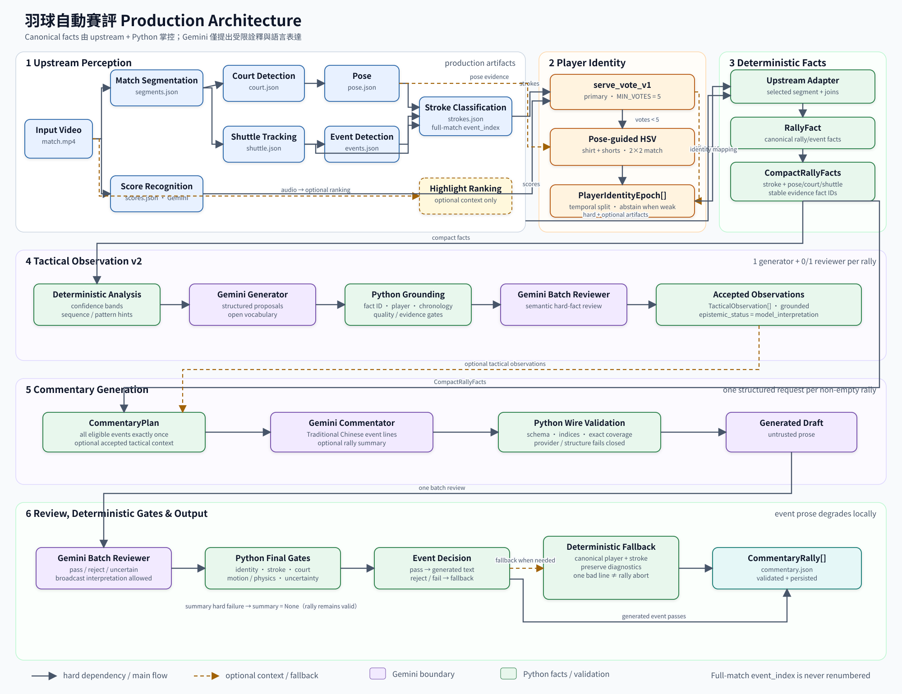
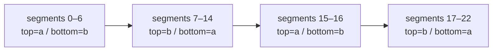

# 羽球比賽自動賽評系統：Production Architecture Report

> 實作基準：`feat/commentary-production-integration-v1` 工作樹（2026-09-16）<br>
> 實測資料：`matches/Kunlavut` 及其 persisted stage artifacts<br>
> 本報告以目前原始碼、contract、測試與 `matches/Kunlavut/stages/commentary/commentary.json` 為準；舊設計文件若與此版本不一致，以目前實作為準。

## 1. 系統目標

目前系統可從一場羽球轉播影片完成以下 production flow：

```text
video
→ CV / recognition stages
→ player identity epochs
→ deterministic RallyFact / CompactRallyFacts
→ grounded TacticalObservation v2
→ per-event Traditional Chinese commentary
→ semantic review
→ deterministic final validation and per-event fallback
→ commentary.json
```

架構的核心是將「觀測事實」、「確定性衍生結果」、「模型詮釋」與「最終文字」分層。`event_index`、frame、time、player、canonical `stroke_type` 與 provenance 均由 upstream artifacts 與 Python 建立；Gemini 只能在提供的 evidence 上提出戰術觀察及文字表達，不能成為 canonical event identity 或時間資料的來源。最終 artifact 仍由 Python 組裝與驗證。

## 2. Overall Architecture



**圖 1　Production system overview。** CV 與 deterministic stages 建立 canonical facts；Gemini 只負責受限的 tactical interpretation 與 language realization，Python 保留 grounding、identity、coverage 與 final safety authority。主圖使用可縮放 SVG；Mermaid 原始檔保留於 `docs/figures/commentary-production-architecture.mmd`，供快速修改與版本比較。

實際 runner 已在 `modules.runner.available_modules()` 註冊 `CommentaryModule`。Pipeline 依 `StageSpec.dependencies` 與 `optional_dependencies` 排序；hard dependency 未完成時不執行 Commentary，optional artifact 缺少時則降級。

## 3. Upstream Perception Pipeline

| Stage | 主要輸入 | Production artifact | Commentary 的實際用途 | 依賴性 |
|---|---|---|---|---|
| `match_segmentation` | input video | `stages/match_segmentation/segments.json` | segment frame/time 範圍、fps、selected rally 邊界 | Hard |
| `court_detection` | segments、video | `stages/court_detection/court.json` | 經 operator confirmation 與 homography 檢查後建立 court position facts | Optional to Commentary；Hard to `pose` |
| `pose` | segments、court calibration、video | `stages/pose/pose.json` | selected event 附近的 pose geometry；也提供 ankles/bbox 作 court projection；HSV identity fallback 使用 keypoints | Optional to Commentary；Optional to `player_identity` |
| `shuttle_tracking` | segments、video | `stages/shuttle_tracking/shuttle.json` | 建立 image-space incoming/outgoing direction 與品質資訊 | Optional |
| `event_detection` | shuttle、pose；score 可選 | `stages/event_detection/events.json` | canonical full-match hit-event array 與 frame | Hard |
| `stroke_classification` | events、pose、shuttle | `stages/stroke_classification/strokes.json` | `event_index` join、top/bottom hitter、8-class stroke、confidence | Hard |
| `score_recognition` | segments、video、Gemini | `stages/score_recognition/scores.json` | segment-level score context；支援 identity primary policy；不送入 Commentary prompt | Hard |
| `player_identity` | strokes、scores；pose 可選 | `stages/player_identity/identity.json` | 對每個 segment 提供唯一 `top/bottom → a/b` mapping | Hard |
| `highlight_ranking` | `audio_highlight` | `stages/highlight_ranking/highlights.json` | 若存在，以 `context_only_not_probability_or_event_evidence` 傳入 plan | Optional |

`CommentaryModule` 直接讀取 `match_segmentation`、`event_detection`、`stroke_classification`、`score_recognition` 與 `player_identity`。`read_selected_vision_stages()` 再按存在性讀取 pose、court、shuttle；highlight artifact 不存在時 `highlight_score=None`。Kunlavut 目前沒有 `audio_highlight` 或 `highlight_ranking` artifact，因此 production commentary 沒有 highlight context。

Kunlavut upstream 實況為 23 segments、307 `HitEvent`、307 `StrokeLabel`、23 score rows；court artifact 是一筆 global calibration，`detection_failed=false`、`confirmed=true`。Score recognition artifact 記錄的 model 為 `gemini-3.6-flash`，此模型僅屬 upstream score stage，與 Commentary 的 `gemini-3.8-flash` 不同。

## 4. Player Identity

### 4.1 Stable identity 與 court side

`StrokeLabel.player` 與 `PoseFrame.player` 的 `top`／`bottom` 是當下球場位置；Commentary artifact 的 `player` 是 `a`／`b`。兩者在 `PlayerIdentityEpoch` 與 `CourtPositionToPlayer` 邊界才被連接。換邊時，physical/match-local identity 不改名，只更新 mapping：

```text
before swap: top=a, bottom=b
after swap:  top=b, bottom=a
```

人類顯示名稱目前沒有 production contract；`a`／`b` 不會被自動轉成人名。

### 4.2 Primary resolver：`serve_vote_v1`

`modules.player_identity.policy.infer_identity()` 先執行 primary policy：

1. Score delta 判斷 serving scoreboard row。
2. Rally 第一拍只有在 canonical stroke 被辨識為 `發球` 時，才提供 serving court side；dense serve cache 可補回被主分類 gate 排除的 serve。
3. 每個 court-end epoch 彙總 `top_is_a`／`top_is_b` votes。
4. `MIN_VOTES=5` 且兩側票數不相等時，以 `resolved_by="vote"` resolve。
5. 已有足夠 resolved epochs 時，可判斷 `fixed_rows` 或 `tracked_rows` convention，再以 `resolved_by="convention"` 補稀疏 epoch；無可靠 convention 時保留 unresolved。

HSV 不會覆寫 primary 已 resolve 的 epoch；`PlayerIdentityModule` 只在 `result.unresolved` 非空時才 lazy-load visual fallback。

### 4.3 Pose-guided multi-region HSV fallback

`HsvIdentityFallback` 使用既有 pose 與原始影片，不重新執行 pose model，也不下載 ReID model：

- 每段最多選 24 組 top/bottom frame pairs，至少需要 8 組；frame selection 偏好雙方 pose 品質較好的樣本。
- `shirt ROI` 由 shoulders 到 hips 的收窄四邊形形成；`shorts ROI` 由 hips 到 knees 上方 62% 形成，降低手臂、皮膚、腿部與球場背景比例。
- 各 ROI 建立 16×8×8 HSV histogram，跨 frame averaging 成 prototype。
- Shirt 與 shorts 分開計算 similarity。兩位 prototype 在某區域越容易區分，該區域的 adaptive weight 越高。
- 對 `top→a/b`、`bottom→a/b` 做 2×2 assignment；production gate 要求 assignment score ≥ 0.65 且 margin ≥ 0.10，否則 abstain。
- Orientation switch 需兩筆 resolved observations 支持；中間連續且偏向同方向的 abstained observations 可將 boundary 往前延伸，但不能自行確認 switch。缺失 observation 會留下 unresolved hole。

### 4.4 Kunlavut persisted identity case

Kunlavut primary policy 只有 1 個 usable vote，低於 5，因此原 epoch 無法由 serve votes resolve。Persisted visual metadata 顯示：23 個 segment profiles 中 15 resolved、8 abstained，確認 3 次 visual transitions；shirt/shorts weights 分別為 0.474124 與 0.525876。最終沒有 overlap、沒有 uncovered segment，也沒有 unresolved epoch。

| Epoch | Segments | top | bottom | votes | agreement | resolved_by |
|---:|---:|---:|---:|---:|---:|---|
| 0 | 0–6 | a | b | 0 | 0.0 | `hsv_default` |
| 1 | 7–14 | b | a | 0 | 0.0 | `hsv_default` |
| 2 | 15–16 | a | b | 0 | 0.0 | `hsv_default` |
| 3 | 17–22 | b | a | 0 | 0.0 | `hsv_default` |

這裡必須保留一項語意限制：`visual_fallback.scoreboard_binding=false`。`hsv_default` 從第一個可分離的 visual pair 確定性命名 match-local `a/b`，之後保持穩定並偵測換邊；它沒有獨立證明這組名稱與 scoreboard 上下 row 的 binding。若存在 serve-vote anchor，才會使用 `hsv_fallback` 且 `scoreboard_binding=true`。

## 5. Rally Fact Model

資料轉換由以下函式負責：

```text
read_commentary_inputs()
→ build_rally_fact_from_stages()
→ RallyFact
→ build_compact_rally_facts()
→ CompactRallyFacts
```

| Fact | Authority / derivation | 主要驗證 |
|---|---|---|
| `segment_index` | segments array position | 存在且 frame range 合法 |
| `event_index` | full-match `events[]` index | bounds、唯一、不得 rally-local renumber |
| `frame` | `HitEvent.frame` | 與 `StrokeLabel.frame` 完全相等 |
| `time_sec` | Python 計算 `frame / fps` | segment/frame tolerance 0.001 s |
| `player` | Stroke top/bottom 經 epoch mapping | `None` 保持 unknown，不猜測 |
| `stroke_type` | production 8-class BST output | 缺 label 時保持 unknown |
| `stroke_confidence` | BST output | strict [0,1]；不是 tactical probability |
| `score` | selected `RallyScore` | segment context；缺 row 時為 nullable unknown |
| `highlight_score` | optional ranking artifact | context only；0.0 有效；不決定事件是否存在 |
| pose | selected frame ±2；實際可構建才接受 | missing/null 不移除 stroke |
| court | pose point + inverse homography | trust、finite、court bounds、quality |
| shuttle | configured method 的 ±6 frame samples | image coordinates only；不混 method |

`RallyFact.rally_length` 等於 selected upstream `HitEvent` 數，不是 classified/eligible commentary 數。事件按 `(frame, full-match event_index)` 的 source-time order 建立。若 score 的 `sub_scores` 表示一個 segment 內有多個 recovered rallies，production module 將該 segment 列為 unsupported，不自行挑第一或最後一個。

目前明確不建立為 trusted facts 的資訊包括：rally winner、scoring cause、forehand/backhand、shuttle speed、3D trajectory、心理狀態、continuous movement path 與 player intent。

Kunlavut 有 307 個 compact events；8 個事件因 canonical player unknown 而不符合 Commentary output eligibility，最後 artifact 為 299 個 events。Unknown 仍保留在 rally/compact chronology 中，不會被改名或用交替規則補值。

## 6. Trusted Court Facts

Production 預設 `CourtCalibrationPolicy.STRICT`。`court.json` 的 `confirmed=true` 表示 operator 已確認 detector 產生的 calibration；這不是 detector 自行推論的品質分數。即使 confirmed，程式仍要求：

- `detection_failed=false`；
- selected/global calibration 唯一；
- 3×3 homography 可逆；
- projected point finite 且落在 authoritative 6.10 m × 13.41 m court bounds。

兩個 ankle keypoints 都達 threshold 時，使用 `ankles_midpoint`，quality 為 `reliable`；否則若 bbox 合法，使用 `bbox_bottom_center`，quality 為 `cautious`。Depth 依球員當下 top/bottom half 轉換成 `rear/mid/front`，width 依 court x 三等分為 `left/center/right`。每筆 fact 都帶有 `observed_position_not_continuous_trajectory` 與 `displacement_not_running_path` limitations。

使用目前 artifacts 唯讀重建 23 個 `CompactRallyFacts` 得到：307 events 中 272 有 court projection，其中 238 為 `reliable`、34 為 `cautious`。只有 reliable court facts 進入 `CommentaryPlan` 或成為 TacticalObservation v2 可接受的 `depth_zone`／`width_zone` evidence。

代表例：segment 0 event 0 為 player a、`mid/center`、reliable；event 1 為 player a、`rear/center`、reliable。單點位置只證明 hit frame 的投影觀測，不證明球員從某區一路跑到另一區。

## 7. TacticalObservation v2

目前 production module 呼叫的是 `analyze_tactical_observations()`，而不是仍保留於程式庫中的 v1 fixed-enum `analyze_tactical_facts()`。V2 的 interpretation vocabulary 是自由文字，source capabilities 則刻意很小：

```text
CompactRallyFacts + deterministic pattern hints
→ Gemini ObservationResponse (最多 5 candidates)
→ Python ground_candidate()
→ Gemini batch ReviewResponse
→ accepted TacticalObservation[]
```

Python grounding 逐項檢查：

- evidence `fact_id` 必須存在於 selected rally catalog；
- accepted source field 只允許 `stroke_type`、`depth_zone`、`width_zone`；
- stroke 必須有 known player、canonical 8-class stroke、confidence ≥ 0.70；court evidence 還必須 quality=`reliable`；
- 至少兩個不同 compact event positions；
- chronology 使用 compact positions，不以 event index 數值大小代替時間；
- player、event、field value 與 source frame 由 catalog 回填，模型不能自填可信值；
- candidate ID 由 segment、observation 與 canonical claims 的 JSON 內容經 SHA-256 產生，具 deterministic provenance。

有 grounded candidates 時，整個 rally 再做一次 batch semantic review；沒有 candidates 或全部 grounding rejected 時不呼叫 reviewer。每 rally 因此是 1 次 tactical generation 加 0 或 1 次 tactical review，不會 per-stroke 呼叫。

Accepted object 明確標記：

```json
{
  "grounding_status": "validated",
  "semantic_review": "passed",
  "epistemic_status": "model_interpretation"
}
```

「grounded」只表示 observation 引用真實、順序正確、品質足夠的 source claims；Python 不宣稱已證明該段自然語言在羽球戰術上必然為真。`grounding_checked_interpretation_not_proven` 也是 schema 強制 limitation。合法空結果 `[]` 對應 `generated_empty`，不會強迫模型虛構戰術。

Pose 與 shuttle compact facts 目前會出現在 tactical generator 的 compact payload，但 catalog 不授予可引用 field；accepted v2 evidence 只能來自可靠 stroke 或 court fields。Commentator 收到的是 revalidated accepted observations，不直接收到 raw model candidates。

## 8. Commentator

`build_commentary_plan()` 重新驗證 `RallyFact`、`CompactRallyFacts`、identity mapping 與所有 TacticalObservations，並建立 deterministic `CommentaryPlan`。Unknown player events 保留在 plan chronology，但 `eligible_for_output=false`；其餘事件形成 `required_event_indices`。

Gemini Commentator 的 wire response 很小：

```json
{
  "events": [
    {"event_index": 123, "text": "…"}
  ],
  "summary": "…或 null"
}
```

Gemini 不輸出 frame、timestamp、canonical player、canonical stroke、segment 或 provenance。Python 以 `event_index` join 後附加這些 metadata，形成 `StrokeCommentaryEvent`。Generated events 必須恰好覆蓋 `required_event_indices`，不得 missing、duplicate 或 unknown；summary presence 也必須符合 plan。

`RallyScore` 與 server 不進入 tactical payload；`CommentaryPlan.score_context` 固定為 `withheld_no_outcome_inference`。Low/cautious source stroke 必須包含 `可能`、`似乎`、`看似`、`看來`、`疑似` 等不確定性標記。Accepted TacticalObservations 只是 optional interpretation context；空清單仍可正常生成賽評。

## 9. Commentary Semantic Review 與 Deterministic Gates

最終文字採兩層防線。

### Layer 1：Gemini batch semantic reviewer

單次 reviewer request 同時審查全 rally eligible events 與 optional summary。每個 verdict 為 `pass`、`reject` 或 `uncertain`，並使用 strict violation code：

- `text_evidence_mismatch`
- `unsupported_spatial_claim`
- `unsupported_movement_claim`
- `unsupported_identity`
- `unsupported_intent_or_opportunity`
- `unsupported_causality`
- `unsupported_outcome_or_score`
- `unsupported_stroke_side`
- `unsupported_motion_or_physics`
- `unsupported_fine_stroke_class`
- `broadcast_interpretation`（advisory-only）

Reviewer payload 對每個事件包含 canonical event、trusted court availability、前後一拍 immediate chronology 與 overlapping TacticalObservations。Summary review 才取得整段 canonical sequence 與所有 trusted court facts。

### Layer 2：Python deterministic final validation

Reviewer pass 的文字仍須通過 `_validate_text()`。目前 deterministic categories 是：hidden fine stroke reconstruction、outcome/score、stroke side、motion/physics、psychology、multiple sentences、missing cautious wording，以及數字比分格式。`小球` 可自然表達為 `放小球`／`擋小球`；`發球→發短球/發長球` 等真正增加資訊的 fine class 仍禁止。

實際控制流程如下：

| Reviewer | Deterministic gate | Final behavior |
|---|---|---|
| pass | pass | 保留 generated text |
| reject / uncertain | not evaluated | 該事件使用 deterministic fallback |
| pass | fail | 保留 reviewer=pass 與 deterministic violation diagnostics；該事件 fallback |
| provider/schema/coverage failure | — | Rally fail closed |

事件 deterministic failure 不會再中止整個 rally。Fallback 自身仍經同一 `_validate_text()`；如果連 deterministic template 都不合法，仍會 fail closed。Summary 延續既有政策：review reject/uncertain 時設為 `None`，但不影響事件輸出；summary deterministic validation 若失敗則仍是 structural safety error。

Layer 1 負責需要語意與 evidence 對照的 identity、stroke、order、spatial、movement 等檢查；Layer 2 不假裝能以簡單字串完全重做語意判斷，而是保留明確、可重現的 lexical/factual gates。兩層職責不可混為一談。

## 10. Deterministic Safe Fallback

`_safe_event_fallback()` 完全不再呼叫 LLM。它只讀 `CommentaryPlanEvent` 的 canonical player、canonical stroke、confidence band 與 reliable court zone：

- Reliable：`球員 b 以平快球回擊。`
- Cautious/low：`球員 a 這拍可能於中場中央以小球回擊。`
- Stroke unknown：改為「完成一次擊球」，不虛構球種。

Reviewer reject/uncertain 或 reviewer pass 但 deterministic gate fail 都走相同 fallback。Diagnostics 不改寫歷史：`reviewer_verdict`、reviewer `violation_codes`、`deterministic_gate`、`deterministic_violation_code` 與 `text_source` 分開保存。沒有 repair prompt，也沒有 retry loop。

## 11. Gemini Provider Architecture

Production provider 為 `GeminiProvider`，透過 `google-genai` 的 `GenerateContentConfig` 設定 `response_mime_type="application/json"` 與 Pydantic `model_json_schema()`。SDK structured response 之後仍由本地 `json.loads()` 與 strict Pydantic schema 再驗一次；duplicate keys、trailing/malformed JSON、NaN/Infinity、missing/extra fields 都不會被當成成功結果。

| Phase | Purpose | Model | Thinking level | Max output tokens | Requests / rally | Failure behavior |
|---|---|---|---|---:|---:|---|
| `tactical_generation` | 提出 open-vocabulary observations | `gemini-3.8-flash` | `None`（model default） | 4096 | 1 | provider/schema failure fail closed |
| `tactical_review` | batch semantic review | `gemini-3.8-flash` | `low` | 4096 | 0 或 1 | fail closed |
| `commentary_generation` | 一次產生所有 eligible event prose 與 summary | `gemini-3.8-flash` | `None`（model default） | 4096 | 0 或 1 | fail closed |
| `commentary_review` | batch evidence/semantic review | `gemini-3.8-flash` | `low` | 4096 | 0 或 1 | fail closed |

所有 provider timeout 預設 30 秒。`HttpRetryOptions(attempts=1)` 表示不做自動 retry，也沒有 model fallback。空 rally 不需要 Commentator/reviewer；有事件但 tactical generator 回傳空清單時，仍會執行 Commentary 兩階段。

`ProviderResponse` 僅帶 safe text、returned model 與 optional usage。`ProviderDiagnostics` 在 incomplete/empty response 時保留 finish reason/detail、requested/returned model、token usage、candidate count、text presence 與 parsed-content presence；partial content 不會被提升為 trusted fact。

## 12. Failure Observability

`CommentaryModule` 用 `_ObservedProvider` 為四個 phase 加上 rally/phase context。`ProviderError` 會寫入：

```text
stages/commentary/failure_diagnostic.json
schema_version = commentary-provider-failure-v1
```

Safe diagnostic 包含：failed timestamp、segment、phase、error code、安全截斷後的 message、requested/returned model、finish reason/detail、token usage、candidate count、text/parsed presence、latency、overall/phase call index，以及已完成 rallies 與各 phase call counters。

API credential、system prompt、user payload 與 raw partial response 不會寫入。Error message 會替換 request text、authorization/API-key patterns，且最多保留 512 characters。

新的 run 開始時先移除 stale failure diagnostic。`commentary.json` 只在所有 jobs 完成後寫到 temporary path，再以 replace 發布；失敗不會發布半套新 artifact。Base stage status 仍記錄 failed state。這裡的 safe diagnostic 專門處理 provider failure；schema/grounding/coverage 等非-provider exception 由 stage error/status 呈現。

## 13. Real Kunlavut Production Result

以下數字直接由目前 `commentary.json` 計算，不取自先前執行紀錄。

### 13.1 Output 與 validation metrics

| Metric | Observed value |
|---|---:|
| Schema version | `commentary-rallies-v1` |
| Rallies | 23 |
| Upstream hit events | 307 |
| Final eligible commentary events | 299 |
| Commentator wire-generated events | 299 |
| Generated-source events | 276 |
| Deterministic fallback events | 23 |
| Final summaries | 20 |
| Summary reviewer pass / reject / none | 20 / 2 / 1 |
| Summary omitted by review | 2 |
| Unsupported segments | 0 |
| Missing eligible events | 0 |
| Duplicate event indices | 0 |
| Rally order mismatches | 0 |

Commentary event reviewer verdict 為 280 pass、19 reject、0 uncertain。19 個 reviewer rejects 加上 4 個 reviewer-pass/deterministic-fail，正好形成 23 個 fallback。Reviewer violation counts 為：`unsupported_fine_stroke_class` 8、`unsupported_spatial_claim` 7、`unsupported_movement_claim` 4、`unsupported_motion_or_physics` 2。Deterministic gate 為 276 passed、4 failed、19 not-evaluated；4 個 failure 全部是 `missing_cautious_wording`。

### 13.2 Tactical metrics

| Metric | Observed value |
|---|---:|
| Raw proposals | 62 |
| Deterministic grounding rejects | 0 |
| Tactical reviewer pass / reject | 57 / 5 |
| Accepted TacticalObservations | 57 |
| Rallies with accepted observations | 19 |
| `generated_empty` rallies | 4 |

五個 tactical reviewer rejects 分別為 `text_evidence_mismatch` 2、`unsupported_motion_or_physics` 2、`unsupported_intent_or_causality` 1。Empty tactical result 沒有造成 Commentary failure。

### 13.3 Optional multimodal fact availability

由目前 persisted artifacts 經 production builders 唯讀重建：

| Compact fact | Available | Reliable |
|---|---:|---:|
| Pose | 299 / 307 | quality 依 pose fields；非 tactical evidence capability |
| Court position | 272 / 307 | 238 |
| Shuttle path | 307 / 307 | 297 |

這些 availability 數字描述 `CompactRallyFacts`，不是最終 artifact 欄位。Pose/shuttle 目前不能成為 accepted v2 supporting claim；reliable court depth/width 可以。

## 14. Real Commentary Examples

下列內容直接取自 production artifact，再以 `strokes.json` join canonical stroke。

| Segment / event | Frame / time | Player | Canonical stroke | Final text | Source / validation |
|---|---|---|---|---|---|
| 4 / 97（短 rally） | 3476 / 139.04 s | b | 高遠球，0.6081 | 下方選手這拍似乎選擇以高遠球進行應對。 | generated；review pass；gate pass |
| 20 / 257（長 rally，36 events） | 10371 / 414.84 s | b | 發球，0.5324 | 球員 b 在中場中央位置發球，動作似乎稍顯倉促。 | generated；review pass；gate pass |
| 20 / 271 | 10665 / 426.60 s | b | 小球，0.9160 | 球員 b 以小球回擊。 | fallback；review reject `unsupported_spatial_claim` |
| 0 / 6 | 714 / 28.56 s | b | 高遠球，0.6413 | 球員 b 這拍可能於中場中央以高遠球回擊。 | fallback；review pass；gate fail `missing_cautious_wording` |
| 0 / 11 | 835 / 33.40 s | b | 平快球，0.8942 | 球員 b 以平快球回擊。 | fallback；review reject `unsupported_spatial_claim` |
| 17 / 212 | 8582 / 343.28 s | a | 切球，0.7222 | 球員 a 在後場左側以切球展開調動。 | generated；review pass；gate pass |
| 22 / 296 | 11624 / 464.96 s | b | 殺球，0.7315 | 球員 b 抓準機會展開殺球進攻。 | generated；review pass；gate pass |

Segment 0 的 accepted summary 為：「雙方在多拍來回中頻繁變換節奏，於高遠球拉鋸、網前小球周旋與多次殺球進攻間展開激烈攻防。」

Segments 17 與 20 的 generated summaries 均因 reviewer 判定 `unsupported_spatial_claim` 而在 final artifact 中設為 `None`。Raw rejected summary text 沒有持久化，因此無法從 final artifact 還原；這是資料邊界，不應憑空補寫。

## 15. Identity Side-swap Case Study



Artifact boundary samples 證明 mapping 作用於每個 segment：

| Boundary sample | Stroke court side | Final stable player | 說明 |
|---|---|---|---|
| segment 6, event 127 | top | a | epoch 0 的 top=a |
| segment 7, event 128 | top | b | epoch 1 換邊後 top=b |
| segment 14, event 204 | bottom | a | epoch 1 bottom=a |
| segment 15 | — | — | 有一個 upstream event，但 player unknown，無 eligible commentary |
| segment 16, event 207 | top | a | epoch 2 top=a |
| segment 17, event 212 | bottom | a | epoch 3 bottom=a |

因此 `top/bottom` 不能當成 stable identity。Commentary builder 每次先由 `identity_mapping_for_segment()` 取得恰好一個 epoch mapping，再把 `StrokeLabel.player` 轉成 final a/b；同一 court side 在 segment 6 與 7 會得到不同 stable player，正是換邊所需行為。

## 16. Data / Trust Boundary

| Information | Authoritative source | Gemini 可修改？ | Final validation / handling |
|---|---|---:|---|
| Segment index/range | `segments.json` | 否 | bounds、frame/time tolerance |
| Full-match event index | `events[]` position、`StrokeLabel.event_index` | 否 | join bounds、unique、exact coverage |
| Frame/time | `HitEvent.frame`、Python `frame/fps` | 否 | frame agreement、source-time ordering |
| Court side | Stroke/Pose `top/bottom` | 否 | schema + segment mapping |
| Stable player a/b | `PlayerIdentityEpoch` | 否 | exactly one epoch per segment；unknown 不猜 |
| Canonical stroke | BST 8-class `StrokeLabel` | 否 | model text review；Python metadata 回填 |
| Confidence band | Python threshold 0.70 / 0.50 | 否 | low/cautious prose requires uncertainty marker |
| Court zone | confirmed calibration + pose projection | 否 | homography、bounds、quality；only reliable enters plan |
| Tactical interpretation | Gemini proposal | 可提出 | source grounding + batch review；標記 model interpretation |
| Commentary wording | Gemini Commentator | 可提出 | batch review + deterministic final gate/fallback |
| Score/winner/server/cause | score artifact僅作 upstream context | 不提供給 Commentary model | plan 明示 withheld；review/gates 禁止臆測 |
| Provenance IDs | Python stable IDs | 否 | selected-rally membership、canonical claims、SHA-256 observation ID |

## 17. Architectural Design Principles

1. **Fact–interpretation separation。** `RallyFact` 與 `CompactRallyFacts` 先於 Gemini 建立；TacticalObservation 永遠標記 `model_interpretation`。
2. **Stable identity independent of court side。** `PlayerIdentityEpoch` 將會換邊的 top/bottom 與穩定 a/b 分開；Commentary 只消費 mapping，不重做 identity inference。
3. **Bounded model authority。** Tactical generator 只能引用 catalog capabilities；Commentator wire response 只有 event index 與 text，不能覆寫 frame/time/player/stroke。
4. **Defense in depth。** Provider structured schema、本地 strict parsing、grounding、semantic reviewer、coverage check 與 deterministic text gate 分層執行。
5. **Structural failure fail closed。** Provider incomplete/error、malformed schema、unknown evidence、missing verdict、coverage mismatch 均不會靜默產出成功 artifact。
6. **Per-event graceful degradation。** 單句 reviewer reject/uncertain 或 deterministic failure 使用 canonical fallback；其他事件與可接受 summary 可繼續發布。

## 18. Current Limitations

### 18.1 Correctness / epistemic limitations

- Kunlavut 的 `hsv_default` 是穩定的 match-local visual identity，但 `scoreboard_binding=false`；不能對外宣稱 a/b 已由此 artifact 獨立證明對應 scoreboard rows。
- Tactical semantic review 是模型判斷，不是 badminton ground truth proof；grounding 只證明 evidence correspondence。
- Pose/shuttle 雖進入 compact payload，目前不是 v2 accepted evidence capability；只有 stroke 與 reliable court depth/width 可成為 supporting claims。
- `analyze_rally()` 的部分 deterministic pattern hints 仍以數值 `event_index` gap/contiguity 判斷局部模式；V2 grounding chronology 已使用 compact position，但 hint detector 對非連續或非單調 source indices 可能漏報 pattern。Kunlavut 的 full-match indices 本身連續，未觸發此問題。
- Raw rejected event prose與 rejected summary prose 不持久化；artifact 保存 final text 與 verdict diagnostics，無法事後重建被拒絕的原句。

### 18.2 Quality limitations

- 沒有 verified player display names；成品使用 a/b 或上方/下方等稱呼。
- Canonical taxonomy 是 merged 8 classes，無法可靠恢復 serve 長短等已丟失細分類。`小球→放/擋小球` 僅是允許的自然 lexicalization。
- Forehand/backhand、speed、3D trajectory、winner、scoring cause、心理狀態與 continuous movement path 不在 trusted domain。
- Deterministic fallback 安全但較模板化；generated prose 仍可能重複。
- Kunlavut 沒有 highlight artifact，因此沒有評估 highlight context 對文字品質的作用。

### 18.3 Performance / availability limitations

- Commentary 逐 rally 呼叫 `read_selected_vision_stages()`；pose streaming reader 為驗證完整 JSON envelope 會掃描到檔尾。Kunlavut pose artifact 約 25.5 MB，23 rallies 會重複掃描；這保證 correctness，但增加 I/O 時間。
- 四階段以 rally 為單位循序執行。Kunlavut 共 86 次 Gemini calls，review payload 尤其是 Commentary batch review 輸入較大。
- Provider 明確不 retry。Transient API failure 會留下 safe diagnostic 並停止 stage，需由外部 operator 決定是否重跑。
- HSV fallback 需讀原始影片與 pose；Kunlavut player identity stage 約 64.1 秒，而非純 serve-vote 的毫秒級路徑。

## 19. Performance / Cost Profile

以下是 Kunlavut `commentary.json` persisted usage；它是一場約 23 segments 的觀測結果，不是通用 benchmark。

| Phase | Calls | Input tokens | Output tokens | Thought tokens* | Total tokens | Total latency | Avg latency |
|---|---:|---:|---:|---:|---:|---:|---:|
| Tactical generation | 23 | 261,120 | 14,946 | 31,914 | 307,980 | 195.57 s | 8.50 s |
| Tactical review | 19 | 55,896 | 6,059 | 0* | 61,955 | 94.81 s | 4.99 s |
| Commentary generation | 22 | 102,846 | 11,730 | 18,476 | 133,052 | 160.23 s | 7.28 s |
| Commentary review | 22 | 270,494 | 11,442 | 0* | 281,936 | 73.23 s | 3.33 s |
| **Total** | **86** | **690,356** | **44,177** | **50,390** | **784,923** | **523.84 s** | **6.09 s/request** |

\* Reviewer thought token 欄位在 response metadata 中為 `None`；表中的 0 表示「沒有回報可加總的 thought tokens」，不是模型必然完全沒有內部計算。

平均每 rally 為 3.74 calls、34,127 total tokens 與 22.78 秒 provider latency。Segment 15 沒有 eligible event，因此 Commentator 與 Commentary reviewer 都沒有呼叫；這也是兩者各 22 calls、而非 23 calls 的原因。以 total tokens 與 latency 計，Tactical generation 是最昂貴 phase；以 input tokens 計，Commentary review 最大。

`status.json` 的 Commentary stage 時間為 2026-09-14 20:02:34.383939Z 至 20:14:36.084040Z，wall-clock 約 721.70 秒（12 分 1.7 秒）。Provider latency 加總約 523.84 秒；剩餘約 197.86 秒包含 artifact reading、逐 rally pose envelope scans、fact construction、serialization 與其他 overhead，artifact 無法再精確拆分。

## 20. Verification Basis

本報告撰寫時再次以 `read_artifact(PIPELINE["commentary"], ...)` 驗證 production envelope 與 23 筆 `CommentaryRally` contracts，並以 script 對 diagnostics、coverage、usage、identity epochs 與 upstream join 做聚合。Current worktree 的相關離線測試結果為：

- Focused Commentator / integration：163 passed；
- All Commentary：543 passed、3 個 opt-in real-model tests skipped；
- Player identity：61 passed；
- Commentary compile/import checks：passed；
- `git diff --check`：passed。

重要測試邊界包括：full-match indices、不連續 chronology、unknown identity、court trust、weak evidence、empty tactical output、structured response failure、exact coverage、semantic reviewer reject/uncertain、reviewer-pass/deterministic-fail fallback、summary omission、provider diagnostics、HSV abstention 與 visual epoch transitions。

## 21. Final System Status

目前 production MVP 已完成並在 Kunlavut 實際跑通：

```text
video
→ upstream perception artifacts
→ player identity with visual epoch splitting
→ deterministic rally/compact facts
→ grounded and reviewed TacticalObservation v2
→ one-shot per-rally Commentator
→ batch semantic review
→ deterministic per-event fallback
→ atomic commentary.json
```

Kunlavut 23/23 segments 都有 `CommentaryRally` record，299/299 eligible events 完整覆蓋，無 unsupported segment。這代表 production integration、runner registration、identity consumption、structured Gemini phases、diagnostics 與 final artifact contract 均已存在，不是規劃中的元件。

後續增強可包含：verified player display names、scoreboard-bound visual identity anchor、pose/shuttle evidence capabilities、降低 reviewer payload 與 pose repeated scans、受控 retry/orchestration、更多 badminton-specific evaluation，以及在有新 trusted upstream facts 後加入 forehand/backhand 或速度資訊。這些均不屬於目前架構圖中的已實作能力。

## Implementation Traceability

| Concept | Current implementation |
|---|---|
| Pipeline DAG / artifact contracts | `modules/contracts.py` — `StageSpec`, `PIPELINE`, `CommentaryRally` |
| Runner registration / staleness | `modules/runner.py` — `available_modules()`, `run_pipeline()` |
| Production Commentary orchestration | `modules/commentary/module.py` — `CommentaryModule`, `_ObservedProvider` |
| Commentary CLI | `modules/commentary/__main__.py` |
| Segment-level identity lookup | `modules/commentary/module.py` — `identity_mapping_for_segment()` |
| Identity boundary | `modules/commentary/identity.py` — `CourtPositionToPlayer` |
| Primary identity | `modules/player_identity/policy.py` — `infer_identity()`, `MIN_VOTES` |
| HSV fallback | `modules/player_identity/visual.py` — `HsvIdentityFallback`, `pose_region_histograms()`, `classify_segment_profile()` |
| Visual epoch splitting | `modules/player_identity/visual.py` — `split_orientation_evidence()` |
| Player identity stage | `modules/player_identity/module.py` — `PlayerIdentityModule` |
| Upstream artifact adapter | `modules/commentary/adapters/upstream.py` — `read_commentary_inputs()` |
| Large pose streaming JSON | `modules/commentary/adapters/streaming_json.py` — `iter_records()` |
| Optional vision selection / court trust | `modules/commentary/adapters/vision.py` — `CourtCalibrationPolicy`, `read_selected_vision_stages()` |
| RallyFact construction | `modules/commentary/analysis/fact_builder.py` — `build_rally_fact()` |
| Compact multimodal facts | `modules/commentary/facts/builder.py` — `build_compact_rally_facts()` |
| Deterministic analysis | `modules/commentary/analysis/rally_analyzer.py` — `analyze_rally()` |
| TacticalObservation schema | `modules/commentary/facts/observations.py` — `TacticalObservation`, `SupportingClaim` |
| Tactical grounding | `modules/commentary/analysis/observation_grounding.py` — `ground_candidate()` |
| Tactical generation/review | `modules/commentary/analysis/observation_analyzer.py` — `analyze_tactical_observations()` |
| Commentary planning | `modules/commentary/generation/planner.py` — `build_commentary_plan()` |
| Commentator wire schema | `modules/commentary/generation/response.py` — `CommentatorResponse` |
| Commentary semantic review | `modules/commentary/generation/reviewer.py` — `review_commentary()` |
| Reviewer contract/codes | `modules/commentary/generation/review_response.py` |
| Final gates and fallback | `modules/commentary/generation/commentator.py` — `_validate_text()`, `_safe_event_fallback()`, `generate_commentary()` |
| Service boundary | `modules/commentary/services/commentary.py` — `CommentaryService` |
| Provider abstraction | `modules/commentary/providers/base.py` — `LLMProvider`, `ProviderResponse`, `ProviderDiagnostics` |
| Gemini structured provider | `modules/commentary/providers/gemini.py` — `GeminiProvider`, `GeminiConfig` |
| Offline provider | `modules/commentary/providers/fake.py` — `FakeProvider` |
| Integration behavior tests | `tests/test_commentary_integration.py` |
| Commentator/fallback tests | `tests/test_commentary_commentator.py` |
| Tactical grounding tests | `tests/test_commentary_observations.py` |
| Player identity policy/visual tests | `tests/test_player_identity.py`, `tests/test_player_identity_stage.py`, `tests/test_player_identity_visual.py` |
