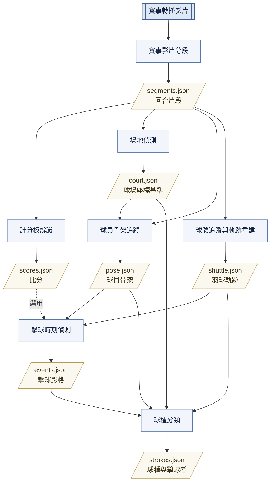
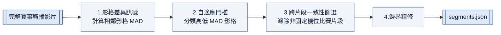
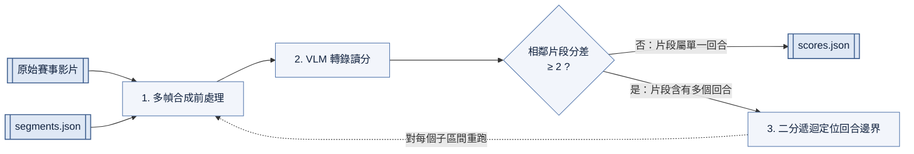
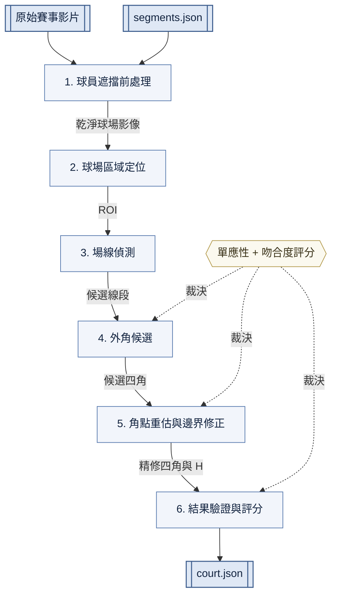
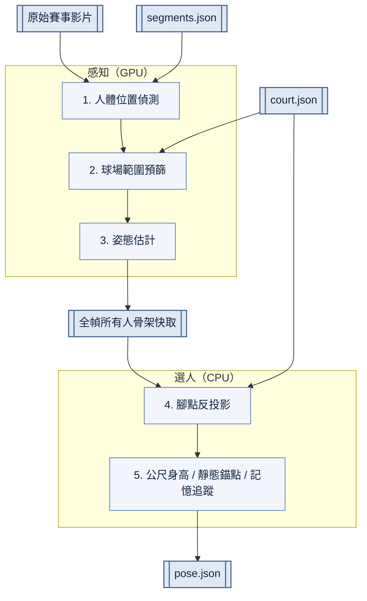
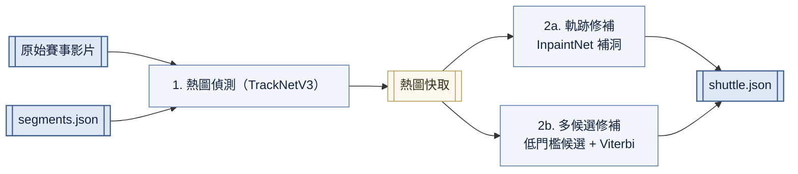
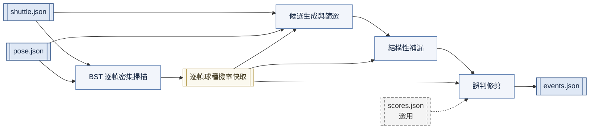
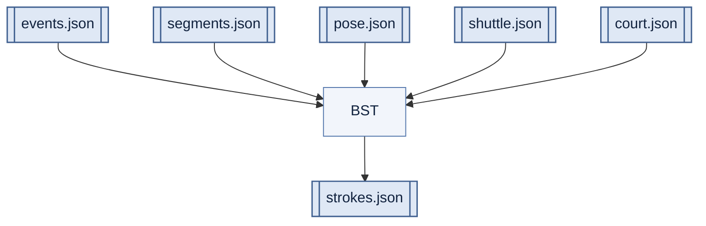

- [一、簡介](#一簡介)
  - [研究動機](#研究動機)
  - [專題目標](#專題目標)
  - [系統概觀](#系統概觀)
  - [主要貢獻與系統亮點](#主要貢獻與系統亮點)
  - [報告結構](#報告結構)
- [二、文獻探討](#二文獻探討)
  - [現有羽球分析系統與產品](#現有羽球分析系統與產品)
  - [關鍵子任務的既有方法](#關鍵子任務的既有方法)
  - [研究缺口與本系統定位](#研究缺口與本系統定位)
- [三、系統設計](#三系統設計)
  - [系統架構](#系統架構)
  - [影片前處理](#影片前處理)
    - [賽事影片分段](#賽事影片分段)
      - [概述](#概述)
      - [影格差異訊號](#影格差異訊號)
      - [自適應門檻](#自適應門檻)
      - [跨片段一致性篩選](#跨片段一致性篩選)
      - [邊界精修](#邊界精修)
    - [計分板辨識](#計分板辨識)
      - [概述](#概述-1)
      - [多幀合成前處理](#多幀合成前處理)
      - [VLM 轉錄讀分](#vlm-轉錄讀分)
      - [還原被合併的回合](#還原被合併的回合)
  - [場景與人體理解](#場景與人體理解)
    - [場地偵測](#場地偵測)
      - [概述](#概述-2)
      - [球員遮擋前處理](#球員遮擋前處理)
      - [球場區域定位](#球場區域定位)
      - [場線偵測](#場線偵測)
      - [單應性與吻合度評分](#單應性與吻合度評分)
      - [外角候選](#外角候選)
      - [角點重估與邊界修正](#角點重估與邊界修正)
      - [結果驗證與評分](#結果驗證與評分)
    - [球員骨架追蹤](#球員骨架追蹤)
      - [概述](#概述-3)
      - [感知：人體偵測與姿態估計](#感知人體偵測與姿態估計)
      - [選人：腳點與球網分半](#選人腳點與球網分半)
  - [球體分析](#球體分析)
    - [球體追蹤與軌跡重建](#球體追蹤與軌跡重建)
      - [概述](#概述-4)
      - [熱圖偵測與快取](#熱圖偵測與快取)
      - [軌跡修補（InpaintNet）](#軌跡修補inpaintnet)
      - [多候選軌跡修補（Viterbi）](#多候選軌跡修補viterbi)
      - [雙軌跡並存](#雙軌跡並存)
    - [擊球時刻偵測](#擊球時刻偵測)
      - [概述](#概述-5)
      - [逐幀球種證據](#逐幀球種證據)
      - [候選生成](#候選生成)
      - [候選篩選](#候選篩選)
      - [結構性補漏](#結構性補漏)
      - [誤判修剪](#誤判修剪)
    - [球種分類](#球種分類)
      - [概述](#概述-6)
      - [分類流程](#分類流程)
  - [使用者介面](#使用者介面)
- [四、實驗結果](#四實驗結果)
  - [資料集與重現方式](#資料集與重現方式)
  - [各模組結果](#各模組結果)
    - [賽事影片分段](#賽事影片分段-1)
      - [偵測準確率](#偵測準確率)
      - [邊界精度](#邊界精度)
      - [失敗案例與限制](#失敗案例與限制)
    - [場地偵測](#場地偵測-1)
      - [角點定位誤差](#角點定位誤差)
      - [色彩擾動壓力測試](#色彩擾動壓力測試)
    - [擊球時刻偵測](#擊球時刻偵測-1)
  - [端到端結果](#端到端結果)
- [五、討論](#五討論)
  - [系統優點與限制](#系統優點與限制)
  - [整個專題哪裡用了AI，怎麼用](#整個專題哪裡用了ai怎麼用)
- [附錄](#附錄)
- [參考文獻](#參考文獻)

# 一、簡介

## 研究動機

> 大綱（待補）：現有羽球分析工具在「可取得、可自訂、可重現、自動化」等面向的不足，導出一般使用者難以取得可自訂分析的痛點。寫成銳利的問題陳述，不要泛談羽球熱門；缺口的完整分析留待第二章。

## 專題目標

> 大綱（待補）：把動機收斂成具體、可被第四章驗證的目標。這條管線吃進什麼、輸出什麼、在什麼前提下運作。講清楚範圍與非目標，避免喊願景。

## 系統概觀

`一張總架構圖 + 資料流`

> 大綱（待補）：以總架構圖配一段話，讓讀者一眼看懂系統整體形狀與各階段如何串接。只給輪廓，模組機制與實作細節留待第三章。

## 主要貢獻與系統亮點

> 大綱（待補）：用數條列出「為什麼這個系統值得看」的差異化重點，可涵蓋自動化程度、工程設計（模組化／可重跑／資料契約等）、與前人不同的技術選擇，以及賽評相關的特色。此節是全報告的濃縮版，讓只讀第一章的人也能抓到核心；每條給結論即可，證據與機制留待第三、四章。

## 報告結構

> 大綱（待補）：一段話說明各章各自負責什麼，作為全報告導航。

# 二、文獻探討

本章回顧羽球影片分析的既有工作：先看整合式系統與商用產品的整體做法與不足，再依本系統面對的關鍵子任務整理學術界的既有方法，最後收斂出研究缺口與本系統的定位。各項技術本身的原理與實作細節不在此贅述，留待第三章各模組說明。

## 現有羽球分析系統與產品

> 大綱（待補）

- 商用／賽事端：鷹眼（Hawk-Eye）與 BWF 官方數據服務提供的統計與判決功能，定位在「即時、專用硬體、封閉」，一般隊伍難以取得原始資料或自訂分析。
- 學術端整合系統：以 AI-Powered Badminton Coach（TENSYMP 2025）為代表，示範「TrackNet ＋ 場地 ＋ 姿態 ＋ 事件 ＋ 球種 ＋ 勝負」串成端到端 timeline 是可行的。
- 共同不足：多為線上／半自動或需人工指定起點；分類與事件多依賴手工特徵 ＋ 傳統 ML；資料格式封閉、模組難以單獨重跑或替換——這正是本系統以離線、模組化 DAG 管線切入的空間。

## 關鍵子任務的既有方法

> 大綱（待補）：依子任務各一小段，說明前人做法與流派差異，帶出本系統採不同路線的背景；技術細節見第三章。

- 回合切割(重要)：以鏡頭角度做二元分類（NCCU Hit-frame）、以事件反推回合起訖（Bosi）等；對比本系統以影格差異訊號自動分段。
- 球場偵測(重要)：學習式角點回歸（Court R-CNN）與幾何式（Hough ＋ 透視／單應、雙路徑交叉驗證）兩種哲學。
- 球體追蹤：熱圖式 TrackNet 家族與偵測式改良 YOLOv8（砍 P5/32、強化小物件頭）兩條路線。
- 擊球時刻偵測(重要)：軌跡訊號法（Y 峰值／X 極值，對 smash 敏感度較低）、姿態方向轉折、擊球者切換 ＋ 角度變化等多種定位思路。
- 球種分類：手工特徵 ＋ 傳統 ML（邏輯迴歸，8 類）與原始影片時空模型（SlowFast ＋ TimeSformer）等，與本系統採用的骨架序列 Transformer（BST）分屬不同輸入型態。
- 計分板讀分：既有工作多由勝負判定間接推分，鮮少直接辨識計分板；本系統以 VLM 直接讀分。
- 音訊事件：Bosi 以 LPC 殘差峰值抓擊球／落地聲，並揭示有觀眾場背景噪音嚴重傷害 recall——供音訊支線參考，若非本報告範圍可略。

## 研究缺口與本系統定位

> 大綱（待補）

- 收斂前兩節：現有工作在「全自動、離線、模組化可重跑、資料契約開放」上仍有缺口，關鍵的分類與事件偵測也多停留在傳統 ML。
- 本系統定位：一條離線批次 DAG 管線，統一資料契約、各階段可獨立重跑，並在球種分類等處採用較新的序列模型；細節見第三章系統設計。

# 三、系統設計
## 系統架構

本系統是一條離線批次處理的管線。輸入是一支未經剪輯的賽事轉播影片，輸出是逐拍的結構化資料：每個回合的時間範圍與比分、球場座標基準、球員骨架、羽球軌跡，以及每一次擊球的影格與球種。目前實作七個階段，由管線執行器依相依關係排序後依序執行。

**資料流總圖：**

除分段階段外，其餘階段都以 `segments.json` 界定分析範圍，再各自從原始影片讀取需要的影格，因此不需要事先把影片剪成一個個小檔案。

**模組相依與輸入輸出：**

| 階段               | 相依階段                               | 輸出檔          | 一筆記錄的內容                                                           |
| ------------------ | -------------------------------------- | --------------- | ------------------------------------------------------------------------ |
| 賽事影片分段       | —（直接讀原始影片）                    | `segments.json` | 一個固定機位比賽片段的起訖影格與起訖秒數                                 |
| 計分板辨識         | 分段                                   | `scores.json`   | 一個片段的最終比分、發球方與局數；片段內含多個回合時另記子比分與切點秒數 |
| 場地偵測           | 分段                                   | `court.json`    | 球場四個外角，以及球場公尺與影像像素之間的單應矩陣                       |
| 球體追蹤與軌跡重建 | 分段                                   | `shuttle.json`  | 一幀中羽球的座標與可見性，兩種軌跡各一份                                 |
| 球員骨架追蹤       | 分段、場地偵測                         | `pose.json`     | 一幀中兩名球員的 17 個關節點與人體框                                     |
| 擊球時刻偵測       | 球體追蹤、骨架追蹤（比分為選用）       | `events.json`   | 一次擊球的影格編號                                                       |
| 球種分類           | 擊球偵測、骨架追蹤、球體追蹤、場地偵測 | `strokes.json`  | 一次擊球的球種（8 類）、擊球者與信心                                     |

比分對擊球偵測是「有就用、沒有也能跑」的選用相依：它只支撐一條精修規則，不應讓使用者為了偵測擊球而必須先準備 API 金鑰。

**設計約定：** 管線由三個約定串起來，讓各階段能各自開發、單獨執行與重跑。

1. **單一產物、統一格式。** 每個階段只寫一個 JSON 產物，外層固定是一個物件、內含一組記錄陣列，記錄欄位由程式中的資料類別統一定義。因為形狀一致，讀寫共用同一組函式，新增階段只需定義資料類別，不必自己寫檔案 I/O；下游也只依賴這份契約，不必匯入上游的實作。
2. **以絕對影格編號對齊。** 所有階段的記錄都以原始影片的絕對影格編號標定時間，而不是片段內的相對編號。任兩個階段的產物因此可以直接對齊，不需要換算，也不必回頭查 `segments.json`。
3. **產物與快取分離。** 每場比賽一個資料夾，分成三區：`input/` 放原始影片，`stages/` 放各階段產物與紀錄執行狀態的 `status.json`，`cache/` 放昂貴但可重建的中間結果（降解析度影片、TrackNet 熱圖、人體偵測結果、逐幀球種機率）。快取以內容命名並以片段為單位存放，因此中斷可續跑，重新分段時也只有內容真正改變的片段需要重算。

**執行與重跑：** 執行器依相依關係排序後逐一執行各階段，已完成的階段預設跳過。跳過與否不只看「是否跑過」，還會比對上游產物的內容雜湊：上游重跑後結果改變的階段會被標記為過期並重做。任一階段失敗即停止整條管線，後續階段不會拿到半成品。

## 影片前處理
### 賽事影片分段

#### 概述

**問題與目標：** 一支羽球轉播影片中，適合進行球員、羽球軌跡分析的畫面，主要來自固定俯拍的機位。若系統直接分析整部影片，非固定機位比賽畫面會產生大量錯誤資料，也浪費運算資源。本模組從轉播影片中找出固定機位比賽畫面，作為後續模組的輸入。

**設計重點：** 本模組不需額外訓練模型、標註資料，也不需針對每支影片逐片人工調整參數，依據影片的統計結構自適應於不同影片。核心設計是把「固定機位比賽畫面主要只有球員移動」這個先驗，轉化為影格差異訊號。固定機位比賽片段的相鄰影格差異小、運鏡與鏡頭切換差異大、靜止的計分板差異極小，因此只用一個廉價的差異指標（MAD）就能把固定機位比賽片段與其他畫面在數值上分開。另一個核心設計是利用「同一機位在不同片段間具有高度相似性」，排除計分板、重播及其他靜止畫面。準確率達到XXX [見4.2.1](#準確率與人工標記比較-和其他系統比)。

**處理流程總覽：**

#### 影格差異訊號

固定機位比賽片段畫面中只有兩名球員與球在動，兩影格間的差異小。其餘片段則落在兩個極端，鏡頭移動與切換使差異極大，靜止的計分板與定格畫面則差異極小。本模組以影格與影格之間的差異作為核心訊號。差異以 MAD（平均絕對差，Mean Absolute Difference）衡量：

$$\mathrm{MAD} = \frac{1}{MN}\sum_{x=1}^{M}\sum_{y=1}^{N} \left| I_1(x,y) - I_2(x,y) \right|$$

其中 $M$、$N$ 為影像寬高，$I(x,y)$ 為座標 $(x,y)$ 的灰階值。選用 MAD 的理由是成本低廉、對離群值不敏感、且動態範圍足夠。計算前先將影片縮放至 480p 以減少計算量 [見4.2.1](#準確率與人工標記比較-和其他系統比)。MAD 不隨解析度改變，相對高低仍然成立。

取樣採每隔三個影格一次，並與前一個取樣影格計算 MAD。間隔取樣一方面縮短處理時間，一方面避免特寫片段和固定機位比賽片段混淆。特寫中球員動作緩慢、背景固定，MAD 偏低且接近固定機位比賽片段，間隔取樣把緩慢位移放大、拉高其 MAD。固定機位比賽片段中球員佔比小、動作劇烈，間隔取樣影響有限。兩類片段因此在 MAD 上分開。

<figure>
  
  <figcaption>部分片段 MAD </figcaption> 
</figure>

圖 3-1 中綠色區塊為手動標記的固定機位比賽片段，虛線為系統算出的門檻，可見綠色區塊的 MAD 通常低於門檻。

#### 自適應門檻

本階段統計全片的 MAD 分佈，設定一個門檻把影格分成低 MAD（固定機位比賽畫面、靜止畫面）與高 MAD（運鏡、鏡頭切換）。不同影片的分佈不同，門檻須隨影片自動調整。

分析前先對 MAD 取以 10 為底的對數。鏡頭切換到完全不同畫面時每個像素都不一樣，會產生極大 MAD，使分佈右側出現長尾。取對數可壓縮長尾，使高低兩側尺度相當。實作取 $\log_{10}(\max(\mathrm{MAD}, 1))$，因為 MAD 可能為 0，需要地板值 1。

<figure>
  
  <figcaption>取對數</figcaption> 
</figure>

**乾淨片段偵測：** 若輸入本身無鏡頭切換，重尾程度會遠低於多鏡頭影片，據此判定乾淨固定機位片段，跳過後續步驟直接輸出。

**門檻方法：** 設門檻的問題與影像二值化相似，二值化統計像素亮度並切成兩類，本階段統計影格 MAD 並切成兩類，故沿用二值化的門檻計算方法。本系統採 Otsu 法，它只要求兩類均值不同即可分離，不限制分佈形狀、不需調參，正好適用於本階段低 MAD 側有尖峰、高 MAD 側是不對稱長尾的情形。

<figure>
  
  <figcaption>固定機位比賽片段與其他片段的 MAD 分佈</figcaption> 
</figure>

<figure>
<table border="1" style="margin: 0 auto;">
  <thead>
    <tr>
      <th>MAD 區間</th>
      <th>佔全片比例</th>
      <th>固定機位比賽比例</th>
      <th style="text-align:center;">畫面性質</th>
    </tr>
  </thead>
  <tbody>
    <tr>
      <td>0–0.5</td>
      <td>6.8%</td>
      <td>28%</td>
      <td>近乎靜止</td>
    </tr>
    <tr>
      <td>0.5–2</td>
      <td>23%</td>
      <td>75%</td>
      <td>固定機位比賽畫面</td>
    </tr>
    <tr>
      <td>2–2.75</td>
      <td>2.3%</td>
      <td>5%</td>
      <td>谷底，門檻落點</td>
    </tr>
    <tr>
      <td>2.75–30</td>
      <td>65%</td>
      <td>約 0%</td>
      <td>重播、運鏡</td>
    </tr>
    <tr>
      <td>30 以上</td>
      <td>2.8%</td>
      <td>7%</td>
      <td>快速轉場</td>
    </tr>
  </tbody>
</table>
  <figcaption>log10(MAD) 的分佈與組成</figcaption>
</figure>

**三類切分：** 直接做兩類 Otsu 會產生系統性偏差，高 MAD 側佔全片 68% 且橫跨 2.75 至 128，類內變異遠大於低 MAD 側，會把切點從谷底推進高 MAD 團內部，讓大量非固定機位比賽影格進入下一步。改用三類切分，上切點（10.80）吸收長尾壓力，下切點（2.81）回到谷底，取下切點為門檻。三類 Otsu 的效果等價於先移除長尾再做兩類 Otsu。

<figure>
  
  <figcaption>三類 Otsu 的兩個切點</figcaption>
</figure>

#### 跨片段一致性篩選

將連續低 MAD 影格串接成片段，此時保留下來的片段中仍混有計分板、定格等靜止片段。關鍵觀察是，此時剩餘的固定機位比賽片段數量多，且全部來自同一個固定機位、彼此在畫面上高度相似。其他片段則各自不同，與任何片段都不像。因此可以透過片段之間相互比較，判斷一個片段是否屬於佔多數的固定機位比賽片段。

設共有 $N$ 個片段，片段 $i$ 取其中央兩張影格，各自縮放至 $128\times72$ 並展開為特徵向量 $v_i^{(1)}, v_i^{(2)}$。兩片段的差異 $d(i,j)$ 取四組跨影格 MAD 的平均，跨片段平均差異 $\bar{d}(i)$ 則是片段 $i$ 對其餘 $N-1$ 段的平均：

$$
d(i,j) = \frac{1}{4}\sum_{a=1}^{2}\sum_{b=1}^{2} \mathrm{MAD}\!\left(v_i^{(a)},\, v_j^{(b)}\right),
\qquad
\bar{d}(i) = \frac{1}{N-1} \sum_{j \neq i} d(i,\, j)
$$

<figure>
  
  <figcaption>跨片段兩兩 MAD 矩陣（依平均差異排序）</figcaption> 
</figure>

因為所有固定機位比賽片段高度相似，它的 $\bar{d}(i)$ 幾乎只由少數幾個非固定機位比賽片段貢獻，數值因而偏低。又因固定機位比賽片段彼此相像，算出的 $\bar{d}(i)$ 也幾乎相等，於是它們在直方圖最左側聚成一個緊密的群。其他片段畫面各異， $\bar{d}(i)$ 偏高且分散。圖 3-5 將片段依 $\bar{d}(i)$ 排序，左上角的紫色密集區即這群固定機位比賽片段。

實測固定機位比賽片段間 $\bar{d}(i)$ 的極差在 5% 以內，最小的非固定機位比賽片段比全體最小值大 13%，門檻取全體最小值的 1.07 倍。此門檻成立的前提是固定機位比賽片段屬於最緊密的群，若影片含大量彼此相似的畫面，會形成新的低 $\bar{d}(i)$ 群使門檻失效，對此的替代方案（KNN 局部密度）見〈設計取捨〉。

<figure>
  
  <figcaption>跨片段平均差異的分佈與門檻</figcaption> 
</figure>

通過篩選的片段中偶爾仍殘留鷹眼判定、官方重播等電腦合成畫面，其構圖與固定機位比賽畫面接近。因此對剩餘片段再算一次跨片段平均差異，採較嚴格的門檻，捨棄超過中位數三倍者。

#### 邊界精修

此階段把被少數高 MAD 影格（分數卡片動畫）切碎的片段接回。同時第一階段的跳幀取樣使邊界存在系統性偏差，需還原到影格層級。

**做兩次片段連接：** 第一次只看距離，間距小於 5 張影格的相鄰片段直接接合。第二次針對 12 張影格以內的間隙逐影格重新掃描，僅當間隙內最大相鄰 MAD 低於 25（即不存在尖峰）時才接合。

**做邊界對齊：** 在每個邊界附近逐影格計算相鄰 MAD，尋找同時滿足絕對值門檻與區域中位數倍率的尖峰，此尖峰對應剪接點，起點設為切入尖峰所在的影格，終點設為切出尖峰的前一張影格。

<figure>
  
  <figcaption>邊界尖峰偵測與修正</figcaption>
</figure>

圖 3-7 中虛線為原始跳幀取樣邊界，綠色實線為修正後的邊界。

### 計分板辨識
 
#### 概述
 
**問題與目標：** 賽事影片分段模組切出的片段中，同一回合可能因中間插入重播、特寫而被切成數段，一個片段也可能因為沒有鏡頭切換而包含多個回合。本模組為每個片段讀出畫面上的記分板比分，判斷片段所屬的回合，該比分同時供下游精彩片段分析使用。
 
**設計重點：** 讀記分板天生受三個困難制約：泛化性（各賽事的記分板設計、位置不固定，且須避開干擾文字）、可讀性（記分板小又模糊）、多局制（三局制記分板易讀錯局）。本模組不需訓練模型或逐賽事調參，以「把難題拆成模型擅長的小任務、再用程式補上模型不擅長的部分」為核心，有三點做法：
 
1. **使用視覺語言模型（VLM）：** 目前使用傳統 OCR 的開源專案都需要手動標記計分板的位置。VLM 直接理解畫面結構，依視覺上下文自行分辨比分。不用為每種記分板寫過濾規則或手動標記，提升跨賽事的泛化能力。
2. **多幀合成：** 利用逐像素合成，強化記分板、糊化背景和球員。在 overlay 只出現於三成影格時仍能完整還原。
3. **提示詞設計：** 轉錄取代挑選，令模型由左到右完整抄寫計分板上所有數字（模型擅長），把當前局比分的挑選（模型易錯）移到程式端，讓較便宜的模型也能快速、正確的完成任務。

端到端逐片段比分準確率達 XXX（見[實驗結果](#四實驗結果)，佔位）。
 
**處理流程總覽：**
 

#### 多幀合成前處理
 
本步驟為每個片段產生一張合成圖，讓 VLM 讀一張圖就拿到比分。轉播的記分板 overlay 只在片段的部分影格出現，若逐張送 VLM 去找，每個片段都得呼叫多次。一個片段通常同屬一回合，比分不變、記分板靜態，因此把片段取樣的多張影格逐像素合成，間歇出現的記分板被疊加強化、穩定呈現在合成圖上，一個片段只需一次 API 呼叫。不斷移動的球員與觀眾被平均糊化，順帶為 VLM 濾去干擾。
 
合成採 dominant_cluster（主群集平均）：對每個像素的亮度值分箱，只平均落入最多值的那一箱。overlay 出現時亮度幾乎固定，會全擠進同一箱。背景每幀不同而分散各箱。因此最密集的一簇即為記分板。這個方法不預設目標信號在時間上佔多數，即使轉播 overlay 只間歇出現仍能保留。
 
<figure>
  
  <figcaption>overlay 只出現在部分影格時，主群集平均的還原結果</figcaption>
</figure>

#### VLM 轉錄讀分
 
本步驟從合成圖讀出雙方當前比分。多局制記分板每隊並列多局數字，要模型直接判斷「哪個是當前局」容易錯，完整抄寫數字對模型來說不需要推理，比較簡單。因此只要求模型逐隊由左到右抄下所有數字，挑選交給程式，固定取每隊陣列最右一個為當前比分，從根源消除模型讀錯局的可能。
 
實作上使用 Gemini 2.5 Flash，將 temperature 設為 0，並且關閉 thinking，減少結果變化的同時避免模型進行不必要的推理，多餘的推理浪費 token 、時間又容易出錯。

<figure>
  
  <figcaption>轉錄取代挑選：VLM 完整抄寫每隊數字，程式取最右一個為當前比分</figcaption>
</figure>
 
#### 還原被合併的回合
 
分段以鏡頭切換為訊號，兩回合間若沒有切換就會被併進同一片段，此時記分板在片段中途變動，單張合成只讀得到其中一個回合。本步驟負責找出並拆開這類片段。

判斷靠比分本身，正常一回合雙方總分只加一分，因此若某片段雙方比分總和一次增加兩分以上，就代表中間有回合沒被單獨切出，標記為合併片段。

標記後以二分搜尋定出回合交界，在候選區間中點重新合成、讀分，與兩端比較，往比分仍有跳變的一側收斂，逼近比分改變的影格。由於一個片段可能併入不只兩回合，每定出一個切點就對兩側子區間各自遞迴、繼續二分，直到每個子區間都只差一回合。

## 場景與人體理解
### 場地偵測

#### 概述

**問題與目標：** 後續所有球員與球體分析需要以球場座標來解讀位置與距離。本模組從固定俯拍的轉播畫面中定出球場，建立影像平面與球場平面投影的座標基準，供後續步驟使用。

**設計重點：** 本模組不需訓練模型、不需標註，核心是把球場偵測化約為「在畫面中找四個外角」的問題，球場是平面、尺寸由競賽規則規定，定出四角即可解出單應性，其餘 12 條線與 16 個交點全由它投影得出。本模組的初始版本參考了一份以 OpenCV 實作的開源羽球場地偵測程式 [3]，現行版本在其基礎上重新設計，將顏色寫死的處理改為顏色無關的表面分割，並以消失點過濾與網格枚舉取代原本 O(n⁴) 的四邊線窮舉。在此基礎上有三點做法：

1. **零先驗的顏色自適應：** 球場顏色因場館而異，系統不預設任何色彩範圍，參考色與門檻全從畫面即時估計。相較多數開源方案需固定顏色範圍或手動標記，本法無需逐場調參。
2. **多來源並聯、統一吻合度評分裁決：** 不押注單一路徑，兩種遮罩、三種外角來源並行推導，最後由同一個「場線像素吻合度」的評分選出最佳者。遮罩斷裂這類錯誤不可逆，並聯確保唯一的路不會走死。
3. **以最可靠的內部線反推最不可靠的外角：** 球場外緣線透視壓縮最重、最常被遮斷，最難完整偵測。網格枚舉改由遮擋少的內部發球線與中線一起投票決定四角，把證據取用的方向倒轉過來。

角點定位誤差達 XXX 像素（見[實驗結果](#場地偵測-1)，數字待補）。

**處理流程總覽：**

#### 球員遮擋前處理

後續定位球場的主要訊號是顏色與場線，但轉播畫面中球員持續移動遮住場線與色塊，單張影格會使線條斷裂。本步驟要產生一張不含球員與短時雜訊的乾淨球場影像。機位固定時，球場在每張影格的同一座標都呈現相同顏色，唯有球員經過的少數影格例外，故對每個座標取多影格像素值的中位數，佔多數的球場顏色留下、屬於少數的球員與雜訊被濾除。

$$M(x,y) = \mathrm{median}\{I_1(x,y),\dots,I_K(x,y)\}$$

<figure>
  
  <figcaption>四張取樣影格與合成圖</figcaption>
</figure>

#### 球場區域定位

本步驟要圈出球場在畫面中的範圍，好把範圍外的線段擋在後續場線偵測之外。實測對整張畫面掃描會得到近 200 條線段，真正屬於球場的只有 12 條。

<figure>
  
  <figcaption>全畫面掃描到的線段，與落在球場遮罩內的部分</figcaption>
</figure>

分離球場與周邊地板的明顯特徵是顏色，但球場顏色本身未知。做法是在畫面中央偏下取一塊由機位假設保證落在場內的區域 $S$，取其像素在 Lab 色度（a、b）通道的中位數作為球場參考色 $\mathbf{c}$，任一像素的色度與 $\mathbf{c}$ 的距離小於門檻 $\tau_c$ 即判為球場：

$$\mathbf{c} = \big(\mathrm{median}_{S}\,a,\ \mathrm{median}_{S}\,b\big), \qquad \tau_c = \max\!\Big(18,\ 3 \cdot \tfrac{\sigma_a + \sigma_b}{2}\Big)$$

$$C(x,y) = \big[\,\lVert\,(a(x,y),\,b(x,y)) - \mathbf{c}\,\rVert < \tau_c\,\big]$$

其中 $\sigma_a,\sigma_b$ 為 $S$ 在兩色度通道的標準差。捨棄亮度通道使光照與陰影不進入判斷。用中位數以避免取樣區塊內的現像素影響門檻。門檻取 $3\sigma$ 使其隨取樣塊自身的顏色離散程度放寬，下限 18 則用以容忍過於平滑的場地。

<figure>
  
  <figcaption>取樣區塊、參考色與門檻的判定</figcaption>
</figure>

上述門檻得到的是逐像素獨立的判斷，還不是一塊完整區域。白色場線把場地切成數塊，雜訊與反光留下零星破洞。模組以形態學運算補洞去雜點、取面積最大的連通區域、再自畫面左上角向內填充背景，把內部空洞併回球場。

<figure>
  
  <figcaption>形態學清理、最大連通區域與空洞填補各階段的遮罩變化</figcaption>
</figure>

本步驟實際產生的不只一張遮罩。除上述色度版本外，另備一個紋理版本，在色度條件之外再加一道局部亮度標準差門檻，只留下平滑區域，用以濾掉與場地同色卻花紋雜亂的地面贊助商圖樣。另有一個低色度版本，在整體畫面色度過低、色度判準失效時改以亮度相似度取代色度。這些版本不互相取代，而是一併往下送，構成後續多假設並行的二至三組遮罩。

#### 場線偵測

本步驟要在前一步的遮罩範圍內找出球場線，過程分四段，取出屬於線的像素、把像素組織成線段、濾除不屬於球場的線段、合併接近的線段。

取線像素不靠色彩，轉播素材的曝光與白平衡各異、場線的絕對色值並不固定。使用局部亮度突起，一個像素若比水平（或垂直）方向兩側都亮出門檻 $\tau$，即屬近垂直（或近水平）的線像素，$P_h$、$P_v$ 取聯集，比較距離 $d$ 須大於線寬。

$$P_h(x,y) = \big[\,G(x,y)-G(x-d,y) > \tau\,\big] \wedge \big[\,G(x,y)-G(x+d,y) > \tau\,\big]$$

$$P_v(x,y) = \big[\,G(x,y)-G(x,y-d) > \tau\,\big] \wedge \big[\,G(x,y)-G(x,y+d) > \tau\,\big]$$

<figure>
  
  <figcaption>局部亮度突起與場線像素的萃取結果</figcaption>
</figure>

上一步的輸出是散落的像素，以機率霍夫轉換（PPHT，`cv2.HoughLinesP`）把共線者組織成線段。場線常因球員殘影、地面反光與遮罩侵蝕而斷開，霍夫轉換靠投票決定共線性、不依賴像素連通，能跨越這些缺口。

<figure>
  
  <figcaption>霍夫線段與兩族的角度粗分</figcaption>
</figure>

粗分後仍混有地面贊助商圖樣等非球場線段，以透視幾何篩選。球場的 12 條線分屬兩組平行線，在畫面上各自通過一個消失點。找消失點是離群比例可能很高的穩健估計問題，採 RANSAC，隨機取兩條線段、以交點為候選消失點，統計族內有多少線段方向指向它（以線段長度加權），重複數百次取支持度最高者。

<figure>
  
  <figcaption>消失點 RANSAC 三次抽樣的候選點與其支持度</figcaption>
</figure>

球網遮擋常把一條球場線拆成方向略有出入的數段，同一條物理線會以不同位置重複參與運算，故先合併。同族線段方向相近、只在垂直於該方向的位置上分開，取一條參考線把每條線段化為一維位置，位置相近者歸為一簇，每簇以最小平方擬合出一條代表線。數百條線段因此收斂成十餘條物理線，既去除重複，也把後續窮舉的組合數壓到可行範圍。

<figure>
  
  <figcaption>同族線段合併的前後對比</figcaption>
</figure>

#### 單應性與吻合度評分

本步驟解決「如何由四角解出單應性、如何量化一組四角的好壞」的問題。

羽球場的尺寸與 12 條場線位置皆為已知常數，因此可預先建立球場模型座標：5 條縱線對應固定的 x 值，7 條橫線對應固定的 y 值。將模型四角與影像中偵測到的四角建立對應後，即可用 DLT 解出單應性 $\mathrm{H}$，再由 $\mathrm{H}$ 將模型中的 12 條場線與 16 個交點一併投影至影像。

DLT 對趨近退化的輸入不會報錯，仍會得出病態的 $\mathrm{H}$，故對每個 $\mathrm{H}$ 加設合法性檢查：四角須為有限值、不超出畫面、不退化成細條、近端底線不短於遠端。此檢查貫穿後續所有產生 $\mathrm{H}$ 的階段。

<figure>
  
  <figcaption>合法性檢查</figcaption>
</figure>

吻合度評分衡量一 $\mathrm{H}$ 推出的網格與畫面上實際偵測到的場線像素有多吻合。單條線的覆蓋率定義為：沿線等距取若干點、投影到影像，落在最近場線像素容差（4 像素）內的比例。總評分取「貼合度」與「廣度」兩項相乘：

$$S = \underbrace{\frac{1}{12}\sum_{k=1}^{12}\mathrm{cov}_k}_{\text{貼合度}} \times \underbrace{\frac{1}{12}\big\lvert\{\,k : \mathrm{cov}_k > 0.3\,\}\big\rvert}_{\text{廣度}}$$

此評分是整個場地偵測判斷好壞的統一依據，後續的候選選擇與邊界修正都以它裁決。

<figure>
  
  <figcaption>場線像素與其距離轉換圖</figcaption>
</figure>

#### 外角候選

四角須由偵測到的線或遮罩推導，任一種推導都有其失效條件，故本模組並行三種來源、各給一組候選，三者的失效條件互不重疊。

**網格枚舉（主要方法）：** 從候選縱線任取兩條作左右邊界、橫線任取兩條作上下邊界，四線相交得一組四角，枚舉所有 $\binom{10}{2}\times\binom{12}{2}=2970$ 組合，取 12 線網格吻合度最高者。穩健的關鍵在於以最可靠的內部線反推最不可靠的外角，等於讓發球線與中線一起投票決定四角。

<figure>
  
  <figcaption>網格枚舉的候選與其吻合度評分</figcaption>
</figure>

**極端線相交：** 在兩族中各取最外側的兩條線相交得四角，最直接，但要求那四條極端線全部正確，而外緣線最難偵測，故僅作第二來源。它的失效條件與網格枚舉不同，能在枚舉搜尋空間無正解時補位。

**遮罩凸包：** 改用遮罩形狀，取面積最大的外輪廓、求凸包並簡化為多邊形，再由頂點座標的極值取出四角。它不需任何場線，但遮罩邊界經形態學處理與空洞填補、未必等於球場外緣，精度最低，僅在前兩者都產生不出合法 $\mathrm{H}$ 時作為備援。

#### 角點重估與邊界修正

前一步的四角只由少數代表線相交而得，影像中大量場線像素尚未參與，本步驟用上全部線像素把結果調準，分兩階段。

**以 ICP 重估單應性：** 難點在建立線像素與球場模型的對應，影像中場線因透視而方向各異，難以直接配對。利用前一步的近似 $\mathrm{H}$，把每個線像素反投影回球場座標，那裡的縱線是 $x$ 為定值、橫線是 $y$ 為定值的直線，量出該像素離哪條最近即建立對應。再用全部點對重解 $\mathrm{H}$、以新 $\mathrm{H}$ 更新對應，反覆逼近。點對數以千計，採 RANSAC 版本把配錯到相鄰線的像素當離群值排除，對應的距離門檻隨迭代由寬到窄。

<figure>
  
  <figcaption>ICP 第一輪與最終輪的網格與反投影殘差</figcaption>
</figure>

**邊界修正：** 透視壓縮下球場遠端的內、外邊界在畫面上靠得很近，全域解無從分辨，外邊界可能整條鎖到內側線上。本步驟只動四條外邊界，把某條投影線附近的像素依「離線多遠」投到一維直方圖，每條平行線形成一個峰，二維的找線因此降為一維的找顯著峰。遠端刻意偏取最外側的峰重新擬合邊界，因為兩種誤差不對稱，外邊界略往場外時場內物體的相對位置仍成立、下游影響有限，一旦鎖進內側則截斷場內內容、不可逆。搜尋帶寬由寬到窄逐級縮小。這是帶方向的推測，故結果不直接採用，而是回到吻合度評分重算，只有分數未明顯變差才取代原解。

<figure>
  
  <figcaption>投影線的鄰近像素與其離線距離直方圖</figcaption>
</figure>

<figure>
  
  <figcaption>遠端底線由內側峰改取最外側峰的前後對比</figcaption>
</figure>

#### 結果驗證與評分

前述步驟以多假設並行：球場區域定位產生二至三組遮罩，場線偵測再對每組遮罩各給三種外角候選，故候選池大小為遮罩組數乘以三，每個候選都帶著它所依據的線像素圖。本步驟把這一池候選收斂成唯一答案，每個候選經角點重估與邊界修正後，在自己的線像素圖上算出吻合度評分，全部比較之下取最高者，其四角與單應性即為模組的最終輸出。

<figure>
  
  <figcaption>候選池的吻合度評分與勝出者的投影</figcaption>
</figure>

### 球員骨架追蹤

#### 概述

**問題與目標：** 球種分類需要球員的肢體姿態，本模組為每個片段還原場上兩名球員逐幀的骨架，作為下游球種分類的輸入。難點有二：一是廣角轉播下球員在畫面裡常只有一兩百像素高，手肘、手腕等末端關節不易估準；二是畫面中除兩名球員外還有裁判、線審、球僮與觀眾，每個人都有骨架可抽，必須靠球場幾何從中認出真正的球員。

**設計重點：** 本模組的核心不在姿態模型本身，而在如何從畫面中的眾多人體骨架穩定選出真正上場的兩名球員。利用球場幾何與跨幀行為自適應完成，主要有兩點做法：

1. **球場座標選人：** 系統把每個候選人的腳點反投影到正規化球場座標，依所在半場判定遠、近端身分，再綜合場內位置與透視校正後的身高挑選球員。

2. **長短期時序資訊：** 系統先從整場候選人的落點分布找出長時間不動的裁判、線審等靜態錨點並排除，再以短期位置記憶維持同一球員的連續身分。

逐幀選人準確率達 XXX（佔位，見[實驗結果](#四實驗結果)）。

**處理流程總覽：**

#### 感知：人體偵測與姿態估計

第一階段為片段的每一幀還原畫面上所有人的骨架並快取，是整個模組的 GPU 時間瓶頸。先用人體偵測器（YOLOX）框出所有人，再採由上而下路線逐人裁切、放大回模型輸入尺寸後在滿解析度下估骨架（RTMPose），讓很小的球員仍能得到準確的關節點。由於逐人估骨架的成本隨人數線性成長，而每幀偵到的十幾二十人裡真正相關的只有兩到四人，估骨架前先借單應性把每個人的腳點反投影回球場座標，只讓落在放寬球場範圍內者進入姿態模型。

<figure>
  
  <figcaption>由上而下：先裁切放大再估骨架</figcaption>
</figure>

#### 選人：腳點與球網分半

第二階段在快取好的骨架上以純幾何認出 `top`、`bottom` 兩名球員。把每個人化約為一個雙踝中點，經單應性反投影落到正規化球場座標。每一半內通過球場邊界的候選人可能不只一個，因此需要以下的排名與排除準則挑出球員。

**公尺身高排名：** 不能直接選最高的人，像素高度會被透視扭曲。因此先借單應性量出畫面上每點「一公尺對應多少像素」，把候選人放到同一真實尺度上比身高。

**非對稱邊界放寬：** 單應性只在地平面上成立，球員起跳殺球時腳踝離地，反投影會把腳點推到底線之外。為此把場內範圍在底線方向（縱向）放寬、邊線方向（橫向）收緊。

<figure>
  
  <figcaption>腳點反投影至球場座標</figcaption>
</figure>

**靜態錨點排除干擾：** 尺寸與邊界仍擋不住一種情形，站在底線後、身高又與遠端球員相當的裁判，一旦真球員該幀被漏偵便可能頂替上來。關鍵在於是否移動，官員整場腳點落在同一處，球員則掃過整個球場。統計整場每個候選人的腳點落點，把在很高比例的幀裡被占用且幾乎不動的格子標為靜態錨點，之後腳點離錨點太近的候選人一律拒絕。

<figure>
  
  <figcaption>整場腳點落點：固定不動者被判為靜態錨點</figcaption>
</figure>

**有記憶的連續追蹤：** 逐幀獨立選人仍會偶爾跳錯人，故改用帶短期記憶的追蹤器，有記憶時選離「上一幀所在位置」最近的人。記憶過舊即作廢，下一幀重新起始時無前一位置可依靠，便退回用公尺身高挑最高者。連續性成為依據，把漏偵時誤選裁判的風險壓到最低。

## 球體分析
### 球體追蹤與軌跡重建

#### 概述

**問題與目標：** 本模組為每個固定機位比賽片段重建羽球在畫面中的逐幀位置，作為下游擊球時刻偵測與球種分類的基礎。難點在於目標小、速度快，且球常被球員、球拍與球網遮擋。

**設計重點：** 本模組沿用預訓練的 TrackNetV3，並利用時間連續性與運動約束，改善單幀偵測的誤判與缺失，主要有三點做法：

1. **多候選軌跡搜尋：** 以低門檻保留每幀多個候選，再用 Viterbi 找出整段最連貫的路徑，使微弱但連續的真球能排除高信心的孤立誤偵。
2. **互補雙軌跡：** 同時輸出覆蓋率較高的 InpaintNet 軌跡與較保守的 Viterbi 軌跡，供下游依任務分工使用。

逐幀軌跡準確率達 XXX（見[實驗結果](#四實驗結果)，佔位）。

**處理流程總覽：**

#### 熱圖偵測與快取

第一階段要在極小又易與背景混淆的目標上給出可靠證據。系統使用 TrackNetV3 對連續影格進行推論，產生逐幀信心熱圖。熱圖能保留多個可能位置，使後續方法可利用時間連續性決定最合理的軌跡。由於熱圖推論是主要的 GPU 運算，系統將結果按片段快取，使 InpaintNet 與 Viterbi 能共用相同的偵測結果，並可在不重新推論的情況下反覆調整軌跡重建方法。

先以 largest-blob 讀出一條基準軌跡——用信心門檻二值化後取面積最大的連通區塊，以其中心為位置、區塊峰值為該幀信心——這條基準軌跡是修補法的輸入，而選擇法另從同一份熱圖以低門檻自取候選（見下）。

<figure>
  
  <figcaption>從熱圖以 largest-blob 讀出基準軌跡</figcaption>
</figure>

#### 軌跡修補（InpaintNet）

第一種方法先將熱圖二值化，取每幀面積最大的連通區塊作為基準位置，再由補洞網路（InpaintNet[1]）補回遮擋造成的缺幀。補值點的信心標為 0，使下游能區分實際偵測與模型推論。

<figure>
  
  <figcaption>補洞前後路徑差異：被遮擋的缺口補回，飛出畫面上緣的缺口留空</figcaption>
</figure>

#### 多候選軌跡修補（Viterbi）

第二種方法改以全域路徑搜尋壓制孤立誤偵。它用極低門檻把每幀所有稍可能是球的區塊全留作候選，再找一條最像真實飛行的路徑穿過它們。把每幀候選當節點、相鄰候選間連邊，給節點獎勵（信心越高越好）、給邊代價（前後兩點推出的速度越不合物理越貴、跨幀越多越貴），以動態規劃取總分最高的路徑。如此微弱但連貫的偵測能勝過強烈但孤立的偵測。當某幀球員鞋子或場線在信心上壓過真球，只要接不上前後飛行就不會入選。最後才對剩餘缺口依長度與兩端運動狀態決定補或不補，並以卡爾曼濾波填值。

<figure>
  
  <figcaption>低門檻多候選與 Viterbi 選出的最佳路徑</figcaption>
</figure>

#### 雙軌跡並存

修補法與選擇法各有所長、在不同情境下互有勝負，模組因此不在內部挑出贏家，而是把兩條軌跡都算出、都寫進 `shuttle.json` ，把選擇交給握有更多上下文的下游。

### 擊球時刻偵測

#### 概述

**問題與目標：** 本模組在每個片段內標記出每一擊球的影格，為下游球種分類提供窗口範圍。

**設計重點：** 本模組的初始版本參考了開源專案 SoloShuttlePose 的擊球事件偵測（`event_detect`）[4]，其僅以單條球體軌跡的 Y 軸峰值與軌跡轉角判定擊球。現行版本在其基礎上重新設計，改以多源證據融合與結構性補漏取代單一軌跡幾何。一次擊球是軌跡上一瞬間的事件，只在球路上留下細微痕跡，任何單一訊號都不夠可靠。本模組因此同時融合多種訊號，並以召回優先，把不漏拍作為首要目標。主要有兩點做法：

1. **多源證據融合：** 不押注單一訊號，同時利用兩條球體軌跡、球員骨架與逐幀球種模型三種來源。相對於只讀軌跡幾何的做法，任一來源在特定情境失效時仍能由其他來源補上。
2. **結構性補洞：** 不靠放寬偵測門檻加球，而是從「結構上一定有一拍」的位置（交替違規、模型長時間鎖定、發球遮擋）反推漏拍位置。

端到端擊球偵測的召回率與時間誤差達 XXX（見[實驗結果](#四實驗結果)，佔位）。

**處理流程總覽：**

#### 逐幀球種證據

本模組先對每個片段逐影格掃描，將每個影格前後各半秒的窗口，輸入球種分類模型 BST [2]，得到該影格的 25 類球種機率分布。

BST 原本設計的窗口是「兩次擊球之間」，需要以擊球時刻作為窗口邊界。但在本模組，擊球時刻正是需要偵測的目標。因此本模組將所有影格以固定窗口輸入模型，並將輸出反過來作為是否存在擊球的判斷依據之ㄧ。BST 的輸出提供三種輔助證據：

**球種信心：** 若模型對某個影格的窗口給出高信心的球種判斷（例如 0.9 的殺球），代表這個窗口的球路與骨架很接近某個真實擊球的樣態。相較於另一個最高信心僅 0.3 的窗口，前者更可能對應到一次真實擊球。

**擊球者判定：** 即使窗口沒對齊擊球，模型對「擊球者位於畫面上方或下方」的判斷仍相當可靠，比單純比較羽球與兩名球員的距離更為準確，因此在後續分邊時作為優先證據。

**連續球種區間：** 若把某個真實擊球影格前後半秒作為窗口輸入模型會得到球種 a，那麼對它鄰近的前後一兩影格做同樣的事，因窗口內容高度重疊，也極可能得到相同的球種 a，只是信心略低。反過來說，只要觀察到連續多個影格被判為同一球種，就代表該區間附近很可能存在一次擊球。

<figure>
  
  <figcaption>逐幀滑動窗口產生的球種、信心與擊球者證據：(a)–(c) 為三次擊球的窗口球路與擊球者骨架，圈記為擊球時刻；下方時間軸為同一段窗口，真實擊球附近會形成連續的同球種高信心區間</figcaption>
</figure>

#### 候選生成

本步驟分析軌跡中實際存在的有效點。由於不同球種在軌跡上的差異很大，不同位置擊球也會造成軌跡產生不同變化，因此單一訊號無法抓出所有擊球。本步驟尋找下列互補的擊球特徵：

**垂直轉折：** 影像座標的 (y) 值向下增加，因此羽球下降至球員附近、擊球後重新上升時，會在軌跡上形成局部最大值。

**方向與速率突變：** 比較候選前後的速度向量，若方向明顯轉折且速率比例突然改變，較可能是球拍接觸，而非重力造成的平順轉彎。

**由慢轉快：** 平抽或快速推球未必形成明顯垂直轉折，因此另以擊球前後的速率比及水平速度變化尋找候選。

**發球錨點：** 額外偵測回合開頭的陡峭垂直變化與第一段持續上升軌跡，作為發球候選。

本步驟刻意偏向敏感、高召回，先保留不確定候選，再交由後續規則排除。擊球時刻要用來為下一階段的球種模型切分析窗口，一旦漏掉一拍，窗口就會整段錯位，後續的比賽脈絡也會出現難以復原的斷點。

<figure>
  
  <figcaption>四種互補的擊球候選訊號：(a) 弧線底部的凸起、(b) 擊球前後速度向量的轉角與速率比、(c) 擊球前後的速率變化、(d) 回合開頭的兩個發球錨點</figcaption>
</figure>

<figure>
  
  <figcaption>各訊號在完整回合中的候選分布與合併結果：(b) 中沒有任何單一訊號涵蓋全部人工標記，合併後的候選則全部涵蓋，但也多出數個回合結束後的候選</figcaption>
</figure>

#### 候選篩選

本步驟將候選經過三道篩選：

**位移振幅：** 計算候選附近時間窗內的水平與垂直位移範圍，只要其中一軸具有足夠位移便予以保留，以排除球落地後的微小追蹤抖動。

**同球員去重：** 依靠 BST 的輸出判定擊球者，若時間相近的連續候選被判為同球員擊球，通常代表一次擊球同時觸發多種軌跡訊號。系統只保留水平與垂直位移振幅總和較大的候選。

**回合脈絡：** 已知擊球側的候選附近應能找到對側球員的其他擊球候選。目前規則要求在指定時間窗內至少存在兩個對側候選，否則將其視為落地彈跳、追蹤脫線或其他孤立訊號。

<figure>
  
  <figcaption>三道候選篩選規則及其保留／刪除結果：(a) 為一個回合的全部候選，被刪掉的三個標上編號；(b) 為同一批候選分到兩個半場，孤立的候選在對面半場找不到人回擊；編號的理由列在圖下</figcaption>
</figure>

#### 結構性補漏

單靠放寬候選門檻會同時增加大量誤判，因此本步驟只在回合結構或多源證據顯示「此處很可能漏了一拍」時加入擊球。補漏刻意安排在候選篩選之後，序列先經篩選、去除雜訊後較為乾淨，回合脈絡才判斷得準，也才能據此救回一些訊號微弱、難以直接偵測的球。四條補漏規則依序執行，且新加入的擊球不得與既有擊球過近。

**交替違規補漏：** 若序列中相鄰兩拍均由同球員擊出，代表兩者之間可能漏掉一拍對側擊球。系統依序搜尋主軌跡上較弱的垂直或水平轉折，以及 BST 的對側高信心連續區間，找到足夠證據後才補一拍。

**未被認領的鎖定區間：** 若 BST 長時間、高信心地維持同一球種，但附近沒有任何擊球，系統會在該區間內尋找通過振幅條件的弱垂直轉折。BST 在此只指出可能漏拍的區域，不單獨決定擊球影格。

**輔助軌跡救援：** 球體追蹤模組除了主軌跡，另輸出一條 Viterbi 軌跡見[球體追蹤與軌跡重建](#球體追蹤與軌跡重建)，能看到主軌跡因遮擋或過度平滑而漏掉的球。若這條輔助軌跡在某處偵測到候選，且該候選接近 BST 球種訊號的起點、具有足夠信心，便將它加入。

**近端發球補漏：** 畫面下方球員發球時，部分軌跡可能被身體遮擋。若持續上升錨點附近尚無擊球，而 BST 同時提供下方球員的發球證據，系統便在附近被篩掉的候選中選擇最接近者。

<figure>
  
  <figcaption>由擊球序列與連續球種證據反推漏拍位置：(a) 相鄰兩拍同側、(b) 高信心球種區間內沒有擊球；兩者都再由弱轉折定出補上的位置</figcaption>
</figure>

<figure>
  
  <figcaption>由輔助軌跡與發球錨點救回主軌跡漏拍：(a) 只有輔助軌跡看到的點落在球種訊號起點上，(b) 近端發球以持續上升錨點與下方球員的發球證據補回</figcaption>
</figure>

#### 誤判修剪

本步驟清理回合邊緣不屬於實際對打的少數雜訊。僅針對三種很特定、平時不常觸發的情況：

**回合有效區間：** 發球前場上還沒有球在移動，球體追蹤可能把反光亮點之類誤認成球，生出不存在的球路，需剔除。

**尾段落地球：** 回合結束後，羽球的彈跳與滾動仍可能產生軌跡轉折，需剔除。

**計分板死時間：** 特定休息比分下的計分板死時間（如開局 0:0、局中技術暫停）。

<figure>
  
  <figcaption>利用回合有效邊界清除開頭誤偵與尾段落地球：(a)(b) 為兩個完整回合，橘色區間是回合的有效範圍，灰色是範圍之外；被刪掉的擊球標上編號，理由列在圖下</figcaption>
</figure>

<figure>
  
  <figcaption>結合比分與發球證據判定計分板死時間：每個片段只看比分與有無發球證據兩件事，同一個休息比分的連續片段中，最後一個有發球證據的才是真回合；(a) 為開賽前的 0:0，(b) 為局中技術暫停</figcaption>
</figure>

### 球種分類

#### 概述

**問題與目標：** 本階段根據每一次擊球前後的球員姿態、場上位置與羽球軌跡，判斷擊球者及球種。

**設計重點：** 球種分類器採用預訓練的 Badminton Stroke-type Transformer（BST）[2]，本專題不重新訓練或修改其模型架構。BST 解決的是「已知擊球時刻及各項結構化特徵後，如何判斷球種」。本專題在球種分類上的重點在於，利用前述各模組，自動從原始比賽影片產生 BST 所需的全部輸入。

**處理流程總覽：**

#### 分類流程

系統先將每個擊球時刻歸入對應回合，再依 BST 預訓練權重所使用的方式，以相鄰擊球時刻切出分析窗口。窗口內的球員骨架、場上位置與羽球軌跡會按照 BST 的資料格式進行正規化，並統一整理為 100 幀的輸入序列。

整理後的資料送入預訓練 BST，模型輸出 25 類機率，將結果依賽評需求整理為 8 類：高遠球、發球、小球、平快球、殺球、切球、撲球與勾球。若模型輸出未知類別，系統保留為未知。

<figure>
  
  <figcaption>依相鄰擊球時刻建立 BST 的 100 幀輸入窗口：(a) 窗口從上一拍延伸到下一拍之後，相鄰窗口彼此重疊；(b)–(d) 為窗口內的球員骨架、場上位置與羽球軌跡</figcaption>
</figure>

<figure>
  
  <figcaption>BST 的 25 類預測：類別名稱同時給出擊球者與基礎球種，取最高機率的一類後再改名為報告用的 8 類；第二名的放小球同樣會改名為小球，但機率不會與第一名相加</figcaption>
</figure>

## 使用者介面

# 四、實驗結果
## 資料集與重現方式
  共用、精簡（見下方第三段）
   · 影片庫（16 場、來源、解析度/fps）
   · 開發集 / 測試集切分原則
   · 標記可靠度(由同一人完成)、素材與程式公開於 GitHub，人工標記很辛苦，資料有多少

github放:
youtube影片連結、畫質幀率、影片SHA-256、測試環境版本、手工標記結果、標記程式、測試程式
## 各模組結果
   （這裡放一張「全系統摘要表」，一列一模組、只放頭條指標）
### 賽事影片分段
（開場段：一段話講結論 + 主結果表。例如「在 9 場未參與開發的比賽、670 個真值片段上達 P 99.3% / R 99.9%，邊界誤差中位數 0 帧。」）
影片分段為什麼很重要，實驗結果加設計，想驗證什麼，為什麼需要驗這個
#### 偵測準確率
matched/FP/FN，dev/test 分開。和其他系統/baseline 比。IoU ≥ 0.5。關鍵消融實驗

| 比賽           | 真值 ans | 輸出 prog |  matched |    FP |    FN | Precision |    Recall |        F1 |
| -------------- | -------: | --------: | -------: | ----: | ----: | --------: | --------: | --------: |
| **開發集小計** |  **684** |   **687** |  **684** | **3** | **0** | **99.56** |   **100** | **99.78** |
| **測試集小計** |  **670** |   **674** |  **669** | **5** | **1** | **99.26** | **99.85** | **99.55** |
| **合計**       | **1354** |  **1361** | **1353** | **8** | **1** | **99.41** | **99.93** | **99.67** |
#### 邊界精度
邊界誤差分佈(中位數、MAE) + 容差命中率 + 最大誤差 / 離群數

| 比賽           | 起點 mean | 起點 MAE | 起點 max | 終點 mean | 終點 MAE | 終點 min |
| -------------- | --------: | -------: | -------: | --------: | -------: | -------: |
| **開發集小計** | **+0.81** | **0.96** | **+159** | **−0.01** | **0.01** |   **−3** |
| **測試集小計** | **+1.97** | **1.99** | **+748** | **−0.34** | **0.34** | **−115** |
| **合計**       | **+1.38** | **1.47** | **+748** | **−0.17** | **0.17** | **−115** |
#### 失敗案例與限制

### 場地偵測
#### 角點定位誤差
#### 色彩擾動壓力測試

### 擊球時刻偵測
以 SoloShuttlePose 的 `event_detect` 作為 baseline（僅單軌跡 Y 峰值＋轉角、無多源證據與結構性補漏），在同一測試集上與本模組比較召回率與時間誤差，凸顯多源融合與補漏帶來的增益。dev/test 分開，並附各訊號來源的消融。

## 端到端結果
系統處理時間實驗

# 五、討論

## 系統優點與限制
依賴太多假設，有過擬合跡象，對某類影片精準度高，但是有系統完全失效的可能

## 整個專題哪裡用了AI，怎麼用

# 附錄
# 參考文獻

[1] "TrackNetV3: Enhancing ShuttleCock Tracking with Augmentations and Trajectory Rectification." Proceedings of the 5th ACM International Conference on Multimedia in Asia (MMAsia '23), 2023. https://doi.org/10.1145/3595916.3626370

[2] "BST: Badminton Stroke-type Transformer for Skeleton-based Action Recognition in Racket Sports." arXiv:2502.21085, 2025. https://arxiv.org/abs/2502.21085

[3] wulongyuan, "BadmintonCV: Badminton court and players detection using OpenCV," GitHub repository. https://github.com/wulongyuan/BadmintonCV

[4] sunwuzhou03, "SoloShuttlePose: Lightweight singles badminton player and court detection," GitHub repository. https://github.com/sunwuzhou03/SoloShuttlePose

[5] Yu-Hang Chien and Fang Yu, "Automated Hit-frame Detection for Badminton Match Analysis," arXiv:2307.16000v2 [cs.CV], 2023. https://arxiv.org/abs/2307.16000

[6] K. Guo, C.-H. Lin, H.-C. Fu, P.-C. Wu, G.-H. Tu, S.-C. Huang, Y.-Y. Li, Y.-C. Tsai, and Y.-J. Lin Guo, "AI-Powered Badminton Coach: Automated Match Analysis and Key Event Annotation," in 2025 IEEE Region 10 Symposium (TENSYMP), 2025. https://doi.org/10.1109/TENSYMP63728.2025.11144996

[7] K. Anand Kr Singha, M. A. Ali, T. Acharjee, P. Debnath, and S. Ahmadullah, "Badminton Match Analysis Along With Players and Shuttlecock Setection Using Hybrid CNN," in 2025 IEEE Silchar Subsection Conference (SILCON), 2025. https://doi.org/10.1109/SILCON67893.2025.11327275

[8] Samuele Bosi, "Audio-Video techniques for the analysis of players behaviour in Badminton matches," M.Sc. Thesis, Politecnico di Milano, 2020–2021.

